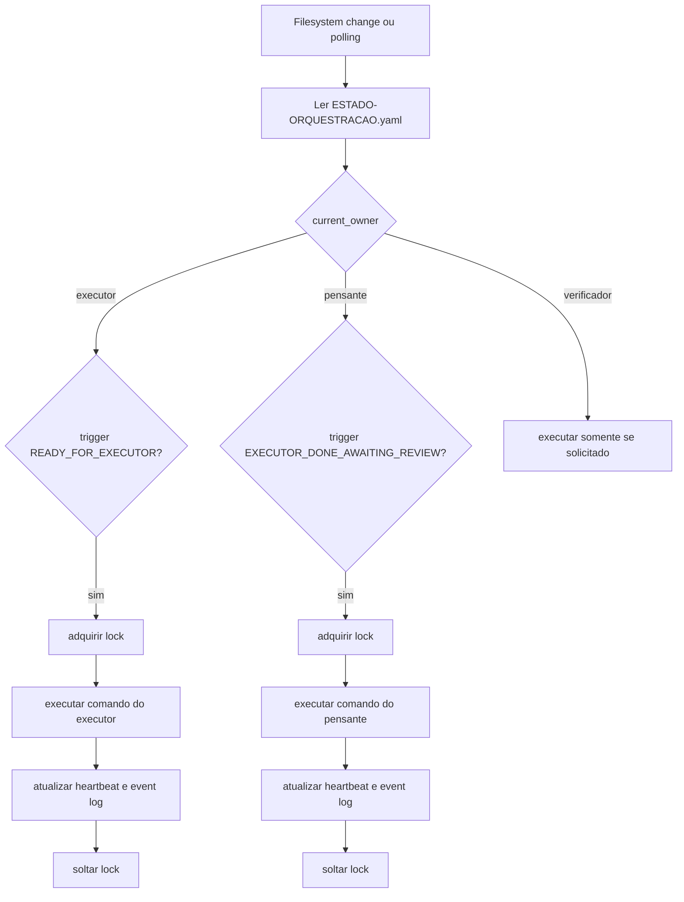
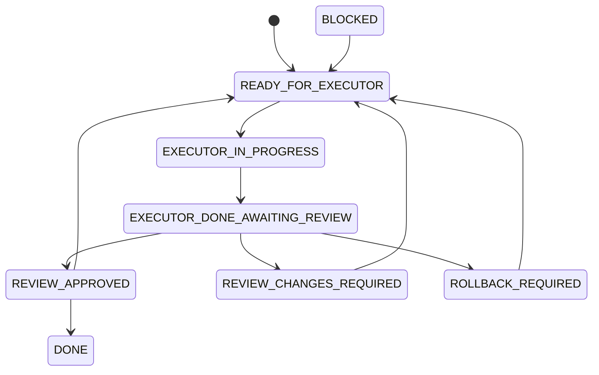

# Automacao de Gatilhos e Orquestracao por Arquivos na pasta IMPLANTAR

Projeto: Receitas Bell  
Assinatura: Desenvolvido por MtsFerreira — mtsferreira.dev

---

## 1. Objetivo

Este arquivo define a arquitetura recomendada para transformar a pasta `IMPLANTAR/` em um barramento operacional entre multiplos agentes, com gatilhos automaticos, polling, watchdog e semaforo de dono da vez.

O objetivo final e permitir que:

1. o Agente Pensante escreva a instrucao
2. o Agente Executor receba a instrucao automaticamente
3. o Executor execute apenas um passo
4. o Executor responda na mesma pasta
5. o Pensante receba esse retorno sem depender de troca manual de contexto
6. exista watchdog periodico para detectar travamento ou abandono de ciclo

---

## 2. FATO, SUPOSICAO e [PENDENTE]

### FATO
- A pasta `IMPLANTAR/` ja e o barramento oficial do projeto para handoff, estado, fila e retorno entre agentes.
- O guia mestre exige execucao sequencial, evidencia, nao-quebra, separacao Pensante x Executor, criterios de aceite e handoff imperativo.
- Vercel suporta Cron Jobs configurados em `vercel.json` ou via API de projeto.
- Supabase Cron usa `pg_cron`, suporta jobs recorrentes e pode invocar SQL, HTTP requests e Supabase Edge Functions.
- A documentacao do Supabase informa que os jobs podem rodar de cada segundo ate anual, com recomendacao de no maximo 8 jobs concorrentes e no maximo 10 minutos por job.
- A documentacao do Supabase tambem mostra o uso combinado de `pg_cron` + `pg_net` para invocar Edge Functions e endpoints HTTP.

### SUPOSICAO
- O Antigravity sera usado como IDE principal e, por ser baseado em VS Code, conseguira operar com tasks automaticas ao abrir a workspace ou com comando equivalente.
- O Executor conseguira ser invocado localmente por CLI, extensao, comando interno do ambiente ou automacao equivalente.
- O ambiente local do usuario aceita rodar um processo residente leve em Python.

**Risco**: compatibilidade parcial entre Antigravity e extensoes/tarefas do VS Code.  
**Reversibilidade**: alta, porque o plano tem fallback para daemon externo independente do editor.  
**Prazo de revalidacao**: antes da implantacao definitiva.

### [PENDENTE]
- Confirmar qual comando real invoca o Agente Executor no ambiente Antigravity usado por voce.
- Confirmar se o ambiente local aceita `watchfiles` ou se sera melhor usar `watchman`.
- Confirmar se o plano da Vercel permite cron com granularidade util para este caso.

---

## 3. Decisao arquitetural

## Arquitetura vencedora

**Pasta `IMPLANTAR/` + daemon local observando arquivos + inicializacao automatica ao abrir a workspace + watchdog remoto recorrente.**

### Motivo
A pasta sozinha nao gera gatilho. Quem gera o gatilho real e um processo observando o filesystem ou um scheduler externo lendo o estado.

### Resultado esperado
- reacao quase imediata para eventos locais
- polling de recuperacao a cada 10 ou 15 minutos
- trilha de auditoria toda salva no repositorio
- sem ambiguidade de quem age agora
- sem perder contexto entre agentes

---

## 4. Camadas da solucao

## Camada A — Barramento por arquivos

Continuar usando estes arquivos como fonte unica de verdade do ciclo:

- `IMPLANTAR/ESTADO-ORQUESTRACAO.yaml`
- `IMPLANTAR/CAIXA-DE-ENTRADA.md`
- `IMPLANTAR/CAIXA-DE-SAIDA.md`
- `IMPLANTAR/STATUS-EXECUCAO.md`
- `IMPLANTAR/00-ORQUESTRACAO-ENTRE-AGENTES.md`
- `IMPLANTAR/00B-GATILHOS-DE-CONVERSA.md`
- `IMPLANTAR/00C-PADRAO-DE-RETORNO-CURTO.md`

### Arquivos novos recomendados

Criar tambem:

- `IMPLANTAR/LOCK.json`
- `IMPLANTAR/HEARTBEAT.json`
- `IMPLANTAR/EVENTOS.log`
- `IMPLANTAR/CONFIG-AUTOMACAO.yaml`

### Papel de cada um

#### `LOCK.json`
Evita corrida entre agentes.

Modelo:

```json
{
  "locked": false,
  "owner": "ninguem",
  "step_id": null,
  "acquired_at": null,
  "expires_at": null
}
```

#### `HEARTBEAT.json`
Registra vida do ultimo agente que atuou.

Modelo:

```json
{
  "last_actor": "executor",
  "last_seen_at": "2026-04-01T12:00:00Z",
  "current_trigger": "EXECUTOR_IN_PROGRESS",
  "current_step_id": "PASSO-1"
}
```

#### `EVENTOS.log`
Jornal append-only de eventos importantes.

Exemplos:

```text
2026-04-01T12:00:00Z READY_FOR_EXECUTOR PASSO-1 owner=executor
2026-04-01T12:02:13Z EXECUTOR_IN_PROGRESS PASSO-1 owner=executor
2026-04-01T12:04:44Z EXECUTOR_DONE_AWAITING_REVIEW PASSO-1 owner=pensante
```

#### `CONFIG-AUTOMACAO.yaml`
Configura o comportamento do daemon e do watchdog.

Modelo inicial:

```yaml
poll_interval_seconds: 10
heartbeat_stale_after_seconds: 900
lock_timeout_seconds: 1200
watchdog_interval_minutes: 15
max_same_step_retries: 2
executor_command: "[PENDENTE]"
pensante_command: "[PENDENTE]"
verificador_command: "[PENDENTE]"
```

---

## Camada B — Daemon local de orquestracao

Criar um daemon local para observar a pasta `IMPLANTAR/`.

### Arquivo recomendado
- `tools/agent_orchestrator.py`

### Responsabilidades
1. observar alteracoes na pasta `IMPLANTAR/`
2. ler `ESTADO-ORQUESTRACAO.yaml`
3. respeitar `current_owner`
4. respeitar `LOCK.json`
5. disparar apenas o agente autorizado
6. atualizar `HEARTBEAT.json`
7. anexar eventos em `EVENTOS.log`
8. impedir loops ou disparos duplicados

### Biblioteca recomendada para MVP
- `watchfiles`

### Biblioteca recomendada para versao mais robusta
- `watchman`

### Regras do daemon
- nunca agir se `locked = true` e o lock nao expirou
- nunca disparar dois agentes ao mesmo tempo
- nunca abrir novo passo sem trigger compativel
- se detectar `BLOCKED` ou `ROLLBACK_REQUIRED`, nao continuar
- se detectar `EXECUTOR_DONE_AWAITING_REVIEW`, passar o dono da vez ao Pensante

### Fluxo do daemon



---

## Camada C — Inicializacao automatica no editor

A recomendacao e iniciar o daemon automaticamente quando a workspace abrir.

### Arquivo recomendado
- `.vscode/tasks.json`

### Objetivo
Ao abrir o projeto no Antigravity ou VS Code compatível:
- subir o daemon
- manter o daemon rodando em background
- evitar depender de comando manual toda vez

### Snippet proposto

```json
{
  "version": "2.0.0",
  "tasks": [
    {
      "label": "agent-orchestrator",
      "type": "shell",
      "command": "python3 tools/agent_orchestrator.py",
      "isBackground": true,
      "problemMatcher": {
        "owner": "custom",
        "pattern": {
          "regexp": ".*"
        },
        "background": {
          "activeOnStart": true,
          "beginsPattern": "ORCHESTRATOR_START",
          "endsPattern": "ORCHESTRATOR_READY"
        }
      },
      "runOptions": {
        "runOn": "folderOpen"
      },
      "presentation": {
        "reveal": "silent",
        "panel": "dedicated"
      }
    }
  ]
}
```

### Fallback
Se o Antigravity nao honrar `runOn: folderOpen`, o daemon deve ser inicializado por script local:

```bash
python3 tools/agent_orchestrator.py
```

---

## Camada D — Watchdog remoto

O daemon local resolve o gatilho em tempo quase real. O watchdog remoto resolve travamentos e abandono de ciclo.

## Opcao preferida
- GitHub Actions rodando a cada 15 minutos

## Opcao alternativa
- Supabase Cron chamando uma Edge Function ou endpoint interno a cada 10 ou 15 minutos

## Opcao nao preferida
- Vercel Cron como primario, por ser melhor para endpoints de aplicacao do que para orquestracao de agentes locais

### Funcoes do watchdog
- verificar se `current_owner` ficou parado tempo demais
- verificar se `HEARTBEAT.json` esta stale
- verificar se existe lock expirado
- escrever evento de erro ou destravar o ciclo quando seguro
- opcionalmente abrir issue, comentario ou notificar o usuario

### Arquivo recomendado
- `.github/workflows/implantar-watchdog.yml`

### Snippet proposto

```yaml
name: implantar-watchdog

on:
  schedule:
    - cron: '*/15 * * * *'
  workflow_dispatch:

concurrency:
  group: implantar-watchdog
  cancel-in-progress: false

jobs:
  watchdog:
    runs-on: ubuntu-latest
    steps:
      - name: Checkout
        uses: actions/checkout@b4ffde65f46336ab88eb53be808477a3936bae11

      - name: Set up Python
        uses: actions/setup-python@42375524e23c412d93fb67b49958b491fce71c38
        with:
          python-version: '3.11'

      - name: Validate orchestration state
        run: python3 scripts/implantar_watchdog.py
```

### O que o script deve fazer
- ler `IMPLANTAR/ESTADO-ORQUESTRACAO.yaml`
- ler `IMPLANTAR/HEARTBEAT.json`
- ler `IMPLANTAR/LOCK.json`
- se detectar stale heartbeat ou lock expirado, registrar em `EVENTOS.log`
- opcionalmente ajustar o estado para `BLOCKED`
- nunca executar codigo de produto
- nunca deployar automaticamente

---

## Camada E — Scheduler alternativo com Supabase

Se voce quiser polling independente do GitHub, pode usar Supabase Cron + Edge Function.

### Quando usar
- quando quiser checagem mesmo sem abrir o editor
- quando quiser guardar historico de eventos no banco
- quando quiser acionar um endpoint interno periodicamente

### Limites praticos
- manter no maximo 8 jobs concorrentes
- manter cada job abaixo de 10 minutos
- usar `pg_net` e `pg_cron`
- guardar secrets em Vault

### Cuidado
Supabase Cron e forte para polling e reparo, mas nao substitui o daemon local para detectar edicoes instantaneas na pasta.

---

## 5. Maquina de estados oficial

Estados validos:

- `READY_FOR_EXECUTOR`
- `EXECUTOR_IN_PROGRESS`
- `EXECUTOR_DONE_AWAITING_REVIEW`
- `REVIEW_APPROVED`
- `REVIEW_CHANGES_REQUIRED`
- `ROLLBACK_REQUIRED`
- `BLOCKED`
- `DONE`

### Regra de transicao



### Regra do dono da vez

Valores validos para `current_owner`:
- `executor`
- `pensante`
- `verificador`
- `ninguem`

Somente o `current_owner` pode agir no proximo ciclo.

---

## 6. Fluxo ideal de uso

### Cenário normal
1. Pensante escreve a mensagem em `CAIXA-DE-ENTRADA.md`
2. Pensante define `READY_FOR_EXECUTOR` e `current_owner: executor`
3. Daemon detecta o estado e chama o Executor
4. Executor atualiza `CAIXA-DE-SAIDA.md` e `STATUS-EXECUCAO.md`
5. Executor muda para `EXECUTOR_DONE_AWAITING_REVIEW` e `current_owner: pensante`
6. Daemon detecta e chama o Pensante
7. Pensante aprova, pede ajuste ou rollback
8. Se aprovado, abre novo passo
9. Se tudo ok, encerra com `DONE`

### Cenário travado
1. Heartbeat fica velho
2. Watchdog remoto detecta
3. Watchdog registra evento
4. Estado vai para `BLOCKED`
5. Pensante reabre o passo com instrucao clara

---

## 7. O que NAO usar como peca principal

### Vercel Cron como motor central
Nao usar como motor central da conversa entre agentes.

Motivo:
- ele e bom para bater endpoints agendados
- mas nao e o melhor lugar para coordenar agentes locais e arquivos do repositório
- ele fica melhor como componente secundario ou inexistente neste desenho

### Extensoes simples de save-only
Nao depender apenas de extensoes que disparam comando ao salvar arquivo.

Motivo:
- elas ajudam no bootstrap
- mas nao resolvem lock, estado, watchdog, heartbeat, semaforo e transicoes

---

## 8. Implementacao recomendada em fases

## Fase 1 — MVP funcional

**Objetivo**: criar orquestracao funcional local com baixo risco.

**Arquivos-alvo**:
- `tools/agent_orchestrator.py`
- `IMPLANTAR/LOCK.json`
- `IMPLANTAR/HEARTBEAT.json`
- `IMPLANTAR/EVENTOS.log`
- `IMPLANTAR/CONFIG-AUTOMACAO.yaml`
- `.vscode/tasks.json`

**Passos exatos**:
1. criar o daemon Python
2. criar arquivos de estado auxiliares
3. configurar task automatica de startup
4. testar ciclo simples com um passo de leitura

**Critério de aceite**:
- [ ] daemon sobe sem erro
- [ ] daemon detecta alteracao no estado
- [ ] daemon escreve heartbeat
- [ ] daemon respeita owner e trigger
- [ ] nenhum disparo duplicado ocorre

**Risco**: medio  
**Rollback**: remover daemon e voltar ao fluxo manual existente  
**Feature flag**: nao necessaria  
**Estimativa**: 60 a 90 minutos

---

## Fase 2 — Watchdog remoto

**Objetivo**: evitar ciclos abandonados.

**Arquivos-alvo**:
- `.github/workflows/implantar-watchdog.yml`
- `scripts/implantar_watchdog.py`

**Passos exatos**:
1. criar workflow agendado
2. criar script de validacao de heartbeat e lock
3. registrar evento se houver stale state
4. impedir autocorrecao destrutiva

**Critério de aceite**:
- [ ] workflow executa em schedule
- [ ] detecta stale heartbeat
- [ ] detecta lock expirado
- [ ] escreve saida objetiva em log ou artifact

**Risco**: baixo  
**Rollback**: desabilitar workflow  
**Feature flag**: nao necessaria  
**Estimativa**: 30 a 45 minutos

---

## Fase 3 — Acionamento alternativo via Supabase

**Objetivo**: ter polling remoto adicional quando desejado.

**Arquivos-alvo**:
- `supabase/functions/implantar-watchdog/index.ts`
- `supabase/migrations/*_implantar_watchdog.sql`

**Passos exatos**:
1. criar Edge Function de cheque leve
2. agendar cron no Supabase a cada 10 ou 15 minutos
3. limitar escopo para leitura e alerta
4. nao mutar estado automaticamente sem regra clara

**Critério de aceite**:
- [ ] cron roda
- [ ] function responde
- [ ] eventos de stale sao detectados

**Risco**: medio  
**Rollback**: desativar cron / remover function  
**Feature flag**: opcional  
**Estimativa**: 45 a 60 minutos

---

## 9. Snippet inicial do daemon

```python
from __future__ import annotations

import json
import time
from pathlib import Path
from datetime import datetime, timezone, timedelta
import subprocess
import yaml
from watchfiles import watch

ROOT = Path(__file__).resolve().parents[1]
IMPLANTAR = ROOT / "IMPLANTAR"
STATE_FILE = IMPLANTAR / "ESTADO-ORQUESTRACAO.yaml"
LOCK_FILE = IMPLANTAR / "LOCK.json"
HEARTBEAT_FILE = IMPLANTAR / "HEARTBEAT.json"
EVENT_LOG = IMPLANTAR / "EVENTOS.log"
CONFIG_FILE = IMPLANTAR / "CONFIG-AUTOMACAO.yaml"


def utc_now() -> str:
    return datetime.now(timezone.utc).isoformat()


def load_yaml(path: Path) -> dict:
    return yaml.safe_load(path.read_text()) if path.exists() else {}


def load_json(path: Path) -> dict:
    return json.loads(path.read_text()) if path.exists() else {}


def save_json(path: Path, payload: dict) -> None:
    path.write_text(json.dumps(payload, indent=2, ensure_ascii=False) + "\n")


def append_event(message: str) -> None:
    EVENT_LOG.parent.mkdir(parents=True, exist_ok=True)
    with EVENT_LOG.open("a", encoding="utf-8") as fh:
        fh.write(f"{utc_now()} {message}\n")


def update_heartbeat(actor: str, trigger: str, step_id: str) -> None:
    save_json(HEARTBEAT_FILE, {
        "last_actor": actor,
        "last_seen_at": utc_now(),
        "current_trigger": trigger,
        "current_step_id": step_id,
    })


def acquire_lock(owner: str, step_id: str, timeout_seconds: int = 1200) -> bool:
    lock = load_json(LOCK_FILE)
    now = datetime.now(timezone.utc)
    if lock.get("locked"):
        expires_at = lock.get("expires_at")
        if expires_at and datetime.fromisoformat(expires_at) > now:
            return False
    save_json(LOCK_FILE, {
        "locked": True,
        "owner": owner,
        "step_id": step_id,
        "acquired_at": utc_now(),
        "expires_at": (now + timedelta(seconds=timeout_seconds)).isoformat(),
    })
    return True


def release_lock() -> None:
    save_json(LOCK_FILE, {
        "locked": False,
        "owner": "ninguem",
        "step_id": None,
        "acquired_at": None,
        "expires_at": None,
    })


def run_command(command: str) -> int:
    result = subprocess.run(command, shell=True)
    return result.returncode


def dispatch_if_needed() -> None:
    state = load_yaml(STATE_FILE)
    config = load_yaml(CONFIG_FILE)
    owner = state.get("current_owner")
    trigger = state.get("current_trigger")
    step_id = state.get("current_step_id", "UNKNOWN")

    if trigger == "READY_FOR_EXECUTOR" and owner == "executor":
        cmd = config.get("executor_command")
        if not cmd or cmd == "[PENDENTE]":
            append_event("BLOCKED missing executor_command")
            return
        if not acquire_lock("executor", step_id, config.get("lock_timeout_seconds", 1200)):
            return
        append_event(f"EXECUTOR_DISPATCH {step_id}")
        update_heartbeat("executor", trigger, step_id)
        try:
            run_command(cmd)
        finally:
            release_lock()

    elif trigger == "EXECUTOR_DONE_AWAITING_REVIEW" and owner == "pensante":
        cmd = config.get("pensante_command")
        if not cmd or cmd == "[PENDENTE]":
            append_event("BLOCKED missing pensante_command")
            return
        if not acquire_lock("pensante", step_id, config.get("lock_timeout_seconds", 1200)):
            return
        append_event(f"PENSANTE_DISPATCH {step_id}")
        update_heartbeat("pensante", trigger, step_id)
        try:
            run_command(cmd)
        finally:
            release_lock()


def main() -> None:
    print("ORCHESTRATOR_START")
    IMPLANTAR.mkdir(parents=True, exist_ok=True)
    if not LOCK_FILE.exists():
        release_lock()
    if not HEARTBEAT_FILE.exists():
        update_heartbeat("ninguem", "BOOT", "BOOT")
    print("ORCHESTRATOR_READY")
    dispatch_if_needed()
    for _changes in watch(str(IMPLANTAR)):
        dispatch_if_needed()


if __name__ == "__main__":
    main()
```

---

## 10. Script inicial do watchdog

```python
from __future__ import annotations

import json
from pathlib import Path
from datetime import datetime, timezone
import yaml

ROOT = Path(__file__).resolve().parents[1]
IMPLANTAR = ROOT / "IMPLANTAR"
STATE_FILE = IMPLANTAR / "ESTADO-ORQUESTRACAO.yaml"
LOCK_FILE = IMPLANTAR / "LOCK.json"
HEARTBEAT_FILE = IMPLANTAR / "HEARTBEAT.json"
EVENT_LOG = IMPLANTAR / "EVENTOS.log"
CONFIG_FILE = IMPLANTAR / "CONFIG-AUTOMACAO.yaml"


def append_event(message: str) -> None:
    with EVENT_LOG.open("a", encoding="utf-8") as fh:
        fh.write(f"{datetime.now(timezone.utc).isoformat()} {message}\n")


def main() -> None:
    config = yaml.safe_load(CONFIG_FILE.read_text())
    heartbeat = json.loads(HEARTBEAT_FILE.read_text())
    stale_after = int(config.get("heartbeat_stale_after_seconds", 900))
    last_seen = datetime.fromisoformat(heartbeat["last_seen_at"])
    delta = (datetime.now(timezone.utc) - last_seen).total_seconds()

    if delta > stale_after:
        append_event(f"WATCHDOG_STALE_HEARTBEAT seconds={int(delta)} actor={heartbeat.get('last_actor')}")
        print("STALE_HEARTBEAT")
        return

    print("HEARTBEAT_OK")


if __name__ == "__main__":
    main()
```

---

## 11. Critérios de aceite finais

A automacao so pode ser considerada pronta quando tudo abaixo for verdadeiro:

- [ ] a pasta `IMPLANTAR/` continua sendo a fonte de verdade
- [ ] existe lock para evitar corrida entre agentes
- [ ] existe heartbeat verificavel
- [ ] existe log append-only de eventos
- [ ] existe daemon local reagindo a mudancas de estado
- [ ] existe startup automatico do daemon ao abrir a workspace ou fallback equivalente
- [ ] existe watchdog remoto a cada 10 ou 15 minutos
- [ ] nenhum agente atua fora do `current_owner`
- [ ] todo passo deixa retorno tecnico e retorno curto
- [ ] rollback do mecanismo de automacao esta documentado

---

## 12. Riscos e tradeoffs

### Risco 1 — Antigravity nao suportar extensoes ou tasks como o VS Code puro
**Impacto**: medio  
**Mitigacao**: usar daemon externo iniciado por comando direto  
**Reversibilidade**: alta

### Risco 2 — Executor nao ter comando invocavel por CLI
**Impacto**: alto  
**Mitigacao**: criar wrapper ou usar operador humano para acionar manualmente o executor enquanto o restante da automacao permanece  
**Reversibilidade**: media

### Risco 3 — polling remoto e local gerarem corrida
**Impacto**: medio  
**Mitigacao**: `LOCK.json`, `current_owner`, `concurrency` no GitHub Actions  
**Reversibilidade**: alta

### Risco 4 — automacao excessiva causar mudanca sem revisao
**Impacto**: alto  
**Mitigacao**: watchdog nunca deve deployar, migrar banco ou mudar codigo de produto sozinho  
**Reversibilidade**: alta

---

## 13. Recomendacao final

### Ordem recomendada de implantacao
1. criar o daemon local
2. criar lock, heartbeat e event log
3. ligar startup automatico do daemon
4. validar ciclo completo local
5. adicionar watchdog remoto via GitHub Actions
6. opcionalmente adicionar Supabase Cron como redundancia
7. nao usar Vercel Cron como motor central desta orquestracao

### Vencedor final
**Watcher local + pasta `IMPLANTAR/` + watchdog remoto**

Essa combinacao entrega o maior nivel de automacao confiavel sem quebrar o protocolo de passos curtos, evidencias e separacao de papeis.
