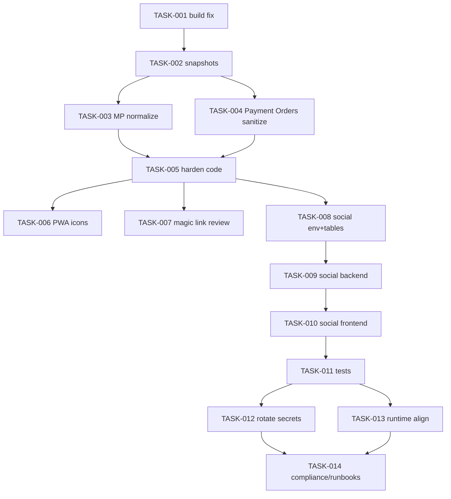

# Plano de Execução Final, Runbooks, Compliance e Previsão de Falhas Futuras

---

## 1. Ordem exata de execução para o Codex

## Fase 1 — destravar o repositório
### TASK-001
**Objetivo:** eliminar o merge conflict do Mercado Pago.  
**Arquivos-alvo:** `src/server/integrations/mercadopago/client.ts`

**Comandos**
```bash
npm run lint
npm run typecheck
npm run build
npm run test:unit
npm run gate
```

**Critério de aceite**
- build passa
- gate passa

**Rollback**
```bash
git checkout -- src/server/integrations/mercadopago/client.ts
```

---

## Fase 2 — estabilizar pagamentos/admin
### TASK-002
**Objetivo:** exportar snapshots antes de tocar dados.  
**Ação:** gerar export lógico de:
- `mercado_pago_connections`
- `Payment_Orders`
- `Settings`
- `magic_links`

### TASK-003
**Objetivo:** normalizar `mercado_pago_connections`.  
**Saída esperada:** settings admin volta a responder.

### TASK-004
**Objetivo:** sanear `Payment_Orders`.  
**Saída esperada:** listagem admin volta a responder.

### TASK-005
**Objetivo:** endurecer `src/server/payments/repo.ts` e `connections.ts`.  
**Saída esperada:** rows legadas/lixo não derrubam o admin.

**Comandos**
```bash
npm run test:unit
npm run build
npm run gate
```

**Validação manual**
```bash
curl -H "Cookie: <admin_session>" https://SEU_HOST/api/admin/payments/settings
curl -H "Cookie: <admin_session>" "https://SEU_HOST/api/admin/payments?dateFrom=2026-03-22T00:00:00.000Z"
```

---

## Fase 3 — corrigir o PWA
### TASK-006
**Objetivo:** corrigir assets de ícones do manifest.  
**Arquivos-alvo:**
- `public/pwa/icons/*`
- `vite.config.ts`

**Comandos**
```bash
file public/pwa/icons/icon-192.png
file public/pwa/icons/icon-512.png
npm run build
find dist -path "*pwa/icons*"
```

**Critério de aceite**
- manifest sem warning
- PNG servido corretamente

---

## Fase 4 — revisar magic link
### TASK-007
**Objetivo:** validar semântica real de expiração.  
**Se necessário:** expand-contract com novo campo datetime.

**Critério de aceite**
- link expira na janela correta em minutos
- não por data genérica

---

## Fase 5 — concluir social auth
### TASK-008
**Objetivo:** adicionar envs e tabelas novas.

### TASK-009
**Objetivo:** implementar backend social auth.

### TASK-010
**Objetivo:** integrar frontend `/minha-conta`.

### TASK-011
**Objetivo:** criar testes de regressão.

**Comandos**
```bash
npm run lint
npm run typecheck
npm run test:unit
npm run build
npm run test:e2e
npm run test:smoke
npm run gate
```

---

## Fase 6 — hardening final
### TASK-012
**Objetivo:** rotacionar segredos operacionais detectados em storage.  
**Regra:** não documentar os valores; apenas registrar quais tipos foram rotacionados.

### TASK-013
**Objetivo:** alinhar runtime Node entre projeto e deploy.

### TASK-014
**Objetivo:** gerar artefatos de segurança/compliance:
- SECURITY.md
- env.example ampliado
- checklist LGPD/GDPR
- PII mapping
- SBOM pipeline
- runbooks formais

---

## 2. Dependências entre tarefas (DAG simplificado)



---

## 3. Runbook de deploy

### Estratégia
- trabalhar no `main`
- mudanças pequenas
- deploy progressivo
- validar após cada bloco

### Para mudanças de comportamento
Usar feature flag:
- `AUTH_SOCIAL_ENABLED`
- `AUTH_SOCIAL_ALLOWED_TENANTS`

### Sequência de canário
1. tenant interno
2. grupo pequeno
3. 25%
4. 50%
5. 100%

### Critério de rollback
Rollback imediato se:
- error rate > 0.5%
- `/api/admin/payments/settings` ou `/api/admin/payments` voltar a 500
- `/api/auth/me` falhar após login social
- login admin sofrer regressão
- build quebrar

---

## 4. Runbook de rollback

### Código
```bash
git revert HEAD
npm run gate
```

### Configuração
```bash
# social auth
AUTH_SOCIAL_ENABLED=false
```

### Dados
- restaurar snapshot das tabelas afetadas
- nunca deletar rows sensíveis sem snapshot anterior

---

## 5. Observabilidade mínima exigida

### Logs
Campos obrigatórios:
- `timestamp`
- `level`
- `service`
- `action`
- `requestId`
- `tenantId`
- `userId` (quando houver)
- `provider`
- `latencyMs`
- `outcome`
- `reason`
- `degraded`

### Métricas
- p50/p95/p99 de `/api/admin/payments`
- p50/p95/p99 de `/api/admin/payments/settings`
- p50/p95 de `/api/auth/oauth/start`
- p50/p95 de `/api/auth/oauth/callback`
- error rate por rota
- backend do rate limit (`upstash` vs `memory`)
- count de rows inválidas ignoradas
- count de connections normalizadas

### Alertas
- 500 em admin/payments > threshold
- 500 em admin/payments/settings > threshold
- aumento de `reconnect_required`
- aumento de social callback failures
- ausência de ícones PWA em smoke

---

## 6. Compliance e segurança

## PII mapping mínimo
- email
- userId
- tenantId
- IP
- user-agent

## Ações obrigatórias
1. Mascarar PII em logs
2. Rotacionar segredos detectados em storage operacional
3. Documentar retenção mínima para logs e tokens
4. Registrar audit trail para:
   - reconnect/disconnect de Mercado Pago
   - normalização de connections
   - exclusão/anulação de rows inválidas
   - criação de vínculo social

## Segredos
Nunca:
- colocar em `.md`
- colocar em commit
- mandar para o Codex como valor real
- deixar em Baserow se já houver fluxo mais seguro

---

## 7. Artefatos a gerar no repositório

### Pasta `implantar/`
- `00-indice-e-regras.md`
- `01-snapshot-auditoria-achados.md`
- `02-mercadopago-admin-pwa.md`
- `03-oauth-social-magic-link.md`
- `04-plano-execucao-runbooks-futuro.md`

### Pasta `/backend` (a ser criada/atualizada pelo executor)
- PRD
- audit
- contracts
- tasks
- checklists
- configs
- scripts
- tests
- runbooks
- handoff
- compliance

### Arquivos mínimos adicionais
- `SECURITY.md`
- `backend/contracts/openapi.yaml`
- `backend/configs/env.example`
- `backend/checklists/security-hardening.md`
- `backend/compliance/pii-mapping.md`
- `backend/handoff/previsao-falhas-futuras.md`

---

## 8. Suposições e [PENDENTE]

### SUPOSIÇÃO 1
A feature prioritária continua sendo social auth do usuário final.
- risco: baixo
- reversibilidade: alta
- prazo para validar: antes do merge final

### SUPOSIÇÃO 2
O login admin não deve receber social auth nesta fase.
- risco: baixo
- reversibilidade: alta
- prazo: imediato

### [PENDENTE] 1
Confirmar logs internos do 500 autenticado para ancorar stack trace exato.
- risco: médio
- reversibilidade: alta
- prazo: antes do deploy final da correção

### [PENDENTE] 2
Confirmar tipo exato do campo `expiresAt` em `magic_links`.
- risco: médio
- reversibilidade: média
- prazo: antes da mudança de schema

### [PENDENTE] 3
Confirmar se existem workflows CI versionados para security scans/SBOM.
- risco: médio
- reversibilidade: alta
- prazo: antes do hardening final

---

## 9. Previsão de falhas futuras

## Horizonte 3 meses
- reentrada de drift entre dados antigos e código novo do Mercado Pago
- novo build quebrado por merge manual ruim
- novo warning PWA por asset trocado sem validação
- social auth liberado sem rate limit distribuído em algum ambiente
- expiração do magic link ainda ambígua se a revisão for adiada

## Horizonte 1 ano
- crescimento do Baserow com mais lixo operacional se não houver jobs de saneamento
- colisão entre magic link e social auth sem modelo claro de conta por tenant
- manutenção difícil sem OpenAPI e runbooks formais
- custo operacional maior por troubleshooting manual

## Horizonte 3 anos
- necessidade de conta global multi-tenant
- necessidade de múltiplos providers sociais com merge/unlink de identidade
- exigência mais forte de compliance e governança de dados
- necessidade de migrar parte do storage operacional para infra mais robusta que Baserow em domínios críticos

---

## 10. Handoff final imperativo para o Codex

1. Trabalhe **somente no `main`**.
2. Não crie branch.
3. Não abra branch temporária.
4. Corrija primeiro o merge conflict de `src/server/integrations/mercadopago/client.ts`.
5. Rode `npm run gate`.
6. Exporte snapshot das tabelas operacionais relevantes.
7. Normalize `mercado_pago_connections`.
8. Sanitize `Payment_Orders`.
9. Endureça `src/server/payments/repo.ts` para ignorar rows inválidas.
10. Endureça a leitura de connections do Mercado Pago para dados legados.
11. Valide `/api/admin/payments/settings`.
12. Valide `/api/admin/payments`.
13. Corrija os ícones do PWA.
14. Valide o manifest sem warning.
15. Revise o schema real de `magic_links`.
16. Se necessário, faça migration expand-contract do campo de expiração.
17. Adicione envs e tabelas novas para social auth.
18. Implemente o backend social auth.
19. Integre `/minha-conta` com Google + fallback por e-mail.
20. Rode testes completos.
21. Rotacione segredos sensíveis detectados em storage operacional.
22. Gere docs mínimas de segurança/compliance.
23. Só considere concluído quando todos os critérios de aceite deste pacote estiverem verdes.
