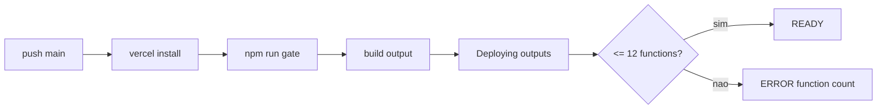

# 35 — Dossiê mestre do executor

Assinatura: [Desenvolvido por MtsFerreira](https://mtsferreira.dev)

Projeto: `mmatteuus/receitasbell`
Branch única: `main`
Objetivo: destravar o deploy de produção na Vercel Hobby sem quebrar admin, auth, checkout e rotas existentes; limpar a pasta `IMPLANTAR` do que já ficou superado; prevenir a próxima repetição do mesmo ciclo.

---

# 1. Checklist roadmap aplicado

| Item | Status | Evidência | Impacto | Ação recomendada | Prioridade |
|---|---|---|---|---|---|
| Último deploy auditado | OK | último deploy real falha apenas em `Deploying outputs...` por limite de funções | bloqueio direto de produção | atacar apenas orçamento de funções | P0 |
| `npm run gate` no último deploy | OK | lint, typecheck, build e testes passaram antes do publish | elimina falso alvo de lint/build | não mexer em lint agora | P1 |
| Catch-all de pagamentos consolidado | OK | webhook já absorvido pelo catch-all | evita retrabalho | não tocar mais no webhook agora | P1 |
| `api/payments/webhook.ts` removido | OK | rota dedicada não existe mais | hipótese antiga invalidada | não recriar | P1 |
| Router de admin catch-all | OK | `api/admin/[...path].ts` já roteia `auth/bootstrap` e `auth/session` | permite cortar wrappers redundantes | usar catch-all como rota única | P0 |
| Wrapper `api/admin/auth/bootstrap.ts` | NOK | wrapper só delega para handler interno | provável função excedente | remover | P0 |
| Wrapper `api/admin/auth/session.ts` | NOK | wrapper só delega para handler interno | provável função excedente | remover | P0 |
| Contrato externo do admin auth | OK | frontend chama `/api/admin/auth/bootstrap` e `/api/admin/auth/session` | não pode quebrar | preservar via catch-all | P0 |
| Pasta `IMPLANTAR` com documentos conflitantes | NOK | há arquivos antigos apontando causas já superadas | gera repetição e alvo errado | arquivar/remover docs superados depois do deploy | P1 |
| `IMPLANTAR/19` como log histórico | OK com ressalva | contém entradas antigas e contraditórias | não serve como snapshot atual | manter como diário, não como status atual | P2 |
| `IMPLANTAR/30` regra permanente | OK | regra de não-quebra já existe | proteção do rollout | manter ativo | P1 |
| `IMPLANTAR/33` reauditoria atual | OK | corrige falso diagnóstico anterior | redefine o alvo certo | manter ativo | P1 |
| `IMPLANTAR/34` dossiê do corte atual | OK | já descreve a remoção dos wrappers | boa base operacional | manter ativo até conclusão | P2 |
| Guard automatizado de orçamento de funções | NOVO | hoje o controle é manual e documental | risco de regressão futura | criar guarda leve após o deploy verde | P2 |
| Smoke de admin auth pós-deploy | NOVO | hoje não está formalizado como gate explícito | risco de 404 silencioso | formalizar smoke de rota | P1 |
| Política de docs ativos vs arquivados no IMPLANTAR | NOVO | hoje tudo fica misturado | aumenta ruído operacional | criar índice ativo e fila de arquivamento | P2 |
| Branch única `main` | OK | regra operacional vigente | reduz variação de estado | manter | P1 |
| Mudança mínima e reversível | OK | corte proposto são 2 arquivos wrapper | baixo risco | executar em uma única mudança cirúrgica | P0 |
| Rollback de 1 comando | NOVO | ainda não formalizado para este corte | reduz MTTR | documentar `git revert` específico | P1 |
| Próximo alvo se P0 não resolver | NOVO | ainda não há prova do próximo excedente | evita chute | auditar o próximo duplicado só com evidência | P1 |

---

# 2. Snapshot do backend

## FATO
- O deploy atual roda em Vercel com output serverless.
- O último deploy real auditado passa `install`, `gate`, `build` e `testes`, e falha apenas no publish por limite de funções.
- O backend já usa barramentos/catch-all em pontos críticos:
  - `api/admin/[...path].ts`
  - `api/auth/[...path].ts`
  - `api/payments/[...path].ts`
  - `api/jobs/[...path].ts`
  - `api/health/[...path].ts`
  - `api/public/[...path].ts`
  - `api/security/[...path].ts`
- O frontend administrativo consome:
  - `/api/admin/auth/session`
  - `/api/admin/auth/bootstrap`
- O catch-all de admin já resolve essas duas rotas internamente.
- Os arquivos `api/admin/auth/bootstrap.ts` e `api/admin/auth/session.ts` são wrappers finos, sem lógica própria.

## FATO — estado atual da pasta IMPLANTAR
### Manter ativos
- `IMPLANTAR/19-REGISTRO-DE-EXECUCAO-DO-EXECUTOR.md`
- `IMPLANTAR/30-REGRA-PERMANENTE-NAO-QUEBRA-E-PREVISAO-DE-RISCO.md`
- `IMPLANTAR/33-REAUDITORIA-CIRURGICA-DEPLOY-FUNCTION-COUNT.md`
- `IMPLANTAR/34-DOSSIE-COMPLETO-EXECUTOR-CORRECAO-FUNCTION-COUNT-E-LIMPEZA.md`
- `IMPLANTAR/35-DOSSIE-MESTRE-EXECUTOR-DEPLOY-E-LIMPEZA-IMPLANTAR.md`

### Arquivos superados / para arquivar ou remover após deploy verde
- `IMPLANTAR/20-BLOQUEIO-CIRURGIA-WEBHOOK-CATCH-ALL.md`
- `IMPLANTAR/24-BLOQUEIO-BUILD-STRIPE-LINT.md`
- `IMPLANTAR/25-CORRECAO-LINT-STRIPE-CONNECT.md`
- `IMPLANTAR/28-CORRECAO-CIRURGICA-DEPLOY-HOBBY-VERCEL.md`
- `IMPLANTAR/29-STATUS-REAL-CORRECAO-DEPLOY-VERCEL.md`
- `IMPLANTAR/31-PROXIMA-CORRECAO-DEPLOY.md`

## SUPOSIÇÃO
- Há 13ª função efetiva materializada no output atual e os wrappers de admin auth são o excesso mais provável.

## Limitações desta análise
- Não houve deleção/edição direta dos arquivos existentes nesta sessão.
- Não foi extraída uma listagem completa do output final de funções da Vercel; o diagnóstico de causa específica parte da comparação entre a topologia atual de rotas e o erro final do deploy.

---

# 3. Trilha escolhida

## TRILHA C — Auditar e melhorar

### Justificativa
O backend já existe, o build já passa e o bloqueio atual está concentrado em orçamento de funções e ruído operacional da pasta `IMPLANTAR`. O trabalho correto agora é auditar, corrigir o mínimo, validar e limpar o ruído sem redesenhar o sistema.

---

# 4. Top 3 fluxos críticos

## Fluxo 1 — Deploy de produção na Vercel


### Pontos de falha
- erro antes do publish: novo bloqueio fora do escopo atual
- erro no publish: orçamento de funções estourado

### Protocolo de não-quebra
- alteração mínima
- sem mexer em contrato externo
- rollback por `git revert`

## Fluxo 2 — Admin auth
```mermaid
flowchart LR
  A[/api/admin/auth/session] --> B[api/admin/[...path].ts]
  A2[/api/admin/auth/bootstrap] --> B
  B --> C[api_handlers/admin/auth/*]
  C --> D[resposta]
```

### Pontos de falha
- 404 se o barramento não preservar o caminho
- 500 se o handler depender de detalhe específico do wrapper dedicado

### Protocolo de não-quebra
- não alterar handler interno agora
- primeiro remover wrapper redundante
- só ajustar catch-all se houver evidência funcional de quebra

## Fluxo 3 — Pagamentos
```mermaid
flowchart LR
  A[/api/payments/checkout/session] --> B[api/payments/[...path].ts]
  A2[/api/payments/webhook] --> B
  B --> C[paymentsRouter]
  C --> D[handlers]
```

### Pontos de falha
- regressão acidental se o executor reabrir frente em payments

### Protocolo de não-quebra
- não tocar em payments nesta etapa
- considerar payments fora do escopo imediato do bloqueio atual

---

# 5. Achados priorizados P0–P3

## P0 — Deploy de produção bloqueado por orçamento de funções
**Problema**: o deploy atual falha apenas no final por limite de funções da Vercel Hobby.

**Onde**: pipeline de deploy da Vercel.

**Evidência**: erro final do último deploy real em `Deploying outputs...` com `No more than 12 Serverless Functions can be added to a Deployment on the Hobby plan.`

**Impacto**: produção não atualiza; qualquer correção futura fica bloqueada.

**Causa provável**: há ao menos uma função dedicada redundante além do orçamento disponível.

**Correção passo a passo**:
1. remover `api/admin/auth/bootstrap.ts`
2. remover `api/admin/auth/session.ts`
3. rodar `npm run gate`
4. push na `main`
5. validar novo deploy

**Comandos exatos**:
```bash
git rm api/admin/auth/bootstrap.ts api/admin/auth/session.ts
npm run gate
git add -A
git commit -m "fix: reduce vercel hobby function count via admin auth consolidation"
git push origin main
```

**Critério de aceite**:
- [ ] `npm run gate` passa
- [ ] deploy não falha mais por function count
- [ ] admin auth continua acessível

**Como testar**:
```bash
npm run gate
# esperado: lint, typecheck, build e testes sem erro
```

**Risco de rollout**: baixo para médio.

**Feature flag**: não.

**Reversibilidade**: alta.

**Protocolo de não-quebra**: ✅ mudança mínima, contrato externo preservado, rollback simples.

---

## P1 — Duplicidade funcional em admin auth
**Problema**: `api/admin/[...path].ts` já resolve `auth/bootstrap` e `auth/session`, mas ainda existem wrappers dedicados para as mesmas rotas.

**Onde**:
- `api/admin/[...path].ts`
- `api/admin/auth/bootstrap.ts`
- `api/admin/auth/session.ts`

**Evidência**:
- o catch-all importa e despacha `adminAuthBootstrap` e `adminAuthSession`
- os wrappers dedicados apenas delegam a `api_handlers/admin/auth/*`

**Impacto**: provável consumo redundante de funções; manutenção duplicada.

**Causa provável**: transição incompleta para barramento unificado.

**Correção passo a passo**:
1. confirmar que o catch-all já resolve as rotas
2. apagar apenas os wrappers
3. não tocar nos handlers internos

**Código / snippet de contingência**: só usar se, após a remoção, houver 404 por path divergente.
```ts
function readPath(request: VercelRequest, prefix: string): string[] {
  const value = request.query.path;
  if (Array.isArray(value) && value.length > 0) {
    return value.map((part) => String(part).trim()).filter(Boolean);
  }
  if (typeof value === 'string' && value.length > 0) {
    return value.split('/').map((part) => part.trim()).filter(Boolean);
  }

  const pathname = (request.url || '').split('?')[0] || '';
  if (!pathname.startsWith(prefix)) return [];

  return pathname.slice(prefix.length).split('/').map((part) => part.trim()).filter(Boolean);
}
```

**Critério de aceite**:
- [ ] `/api/admin/auth/bootstrap` não retorna 404
- [ ] `/api/admin/auth/session` não retorna 404

**Como testar**:
```bash
curl -i https://receitasbell-matdev.vercel.app/api/admin/auth/session
# esperado: status 200 ou 401, nunca 404

curl -i -X POST https://receitasbell-matdev.vercel.app/api/admin/auth/bootstrap \
  -H 'content-type: application/json' \
  --data '{}'
# esperado: status 400/401/422 aceitável, nunca 404
```

**Risco de rollout**: médio.

**Feature flag**: não.

**Reversibilidade**: alta.

**Protocolo de não-quebra**: ✅ sem alteração de contrato, sem tocar na lógica do handler.

---

## P1 — A pasta IMPLANTAR está induzindo diagnóstico repetido
**Problema**: documentos antigos continuam ativos no mesmo nível e apontam causas já superadas.

**Onde**: `IMPLANTAR/20`, `24`, `25`, `28`, `29`, `31`.

**Impacto**: o pensante/executor pode voltar a mexer em webhook, lint ou diagnóstico superado e desperdiçar ciclos.

**Causa provável**: ausência de política clara de `ATIVO vs ARQUIVADO`.

**Correção passo a passo**:
1. não limpar docs antes do deploy verde
2. após deploy verde, remover ou mover para arquivo histórico os documentos superados
3. criar um índice ativo da pasta

**Comandos exatos**:
```bash
mkdir -p IMPLANTAR/ARQUIVADOS
git mv IMPLANTAR/20-BLOQUEIO-CIRURGIA-WEBHOOK-CATCH-ALL.md IMPLANTAR/ARQUIVADOS/
git mv IMPLANTAR/24-BLOQUEIO-BUILD-STRIPE-LINT.md IMPLANTAR/ARQUIVADOS/
git mv IMPLANTAR/25-CORRECAO-LINT-STRIPE-CONNECT.md IMPLANTAR/ARQUIVADOS/
git mv IMPLANTAR/28-CORRECAO-CIRURGICA-DEPLOY-HOBBY-VERCEL.md IMPLANTAR/ARQUIVADOS/
git mv IMPLANTAR/29-STATUS-REAL-CORRECAO-DEPLOY-VERCEL.md IMPLANTAR/ARQUIVADOS/
git mv IMPLANTAR/31-PROXIMA-CORRECAO-DEPLOY.md IMPLANTAR/ARQUIVADOS/
```

**Critério de aceite**:
- [ ] só documentos ativos ficam na raiz de `IMPLANTAR`
- [ ] executor não usa mais docs superados como status atual

**Risco de rollout**: baixo.

**Feature flag**: não.

**Reversibilidade**: alta.

**Protocolo de não-quebra**: ✅ docs-only, após deploy validado.

---

## P2 — Ausência de guarda preventiva para orçamento de funções
**Problema**: o projeto depende de validação manual para não ultrapassar o limite da Vercel Hobby.

**Impacto**: o mesmo erro pode voltar no próximo arquivo novo em `/api`.

**Correção recomendada após o deploy verde**:
1. adicionar checklist obrigatório de orçamento de funções
2. criar um índice de budget em `IMPLANTAR`
3. bloquear criação de wrapper redundante sem justificativa

**Sugestão mínima de artefato**:
- `IMPLANTAR/00-INDEX-ATIVO.md`
- `IMPLANTAR/API-BUDGET-HOBBY.md`

**Risco de rollout**: baixo.

---

## P3 — Se a remoção de admin auth não resolver, há outro duplicado fora do alvo atual
**Problema**: ainda pode existir outra função redundante fora de payments e admin auth.

**Impacto**: o deploy continua falhando mesmo após a correção P0.

**Correção**:
- não chutar
- auditar a árvore `/api` inteira e remover só o próximo duplicado provado

**SUPOSIÇÃO de candidatos**:
- `api/settings.ts`
- `api/events.ts`

**Observação**: esses candidatos só entram em jogo se o P0 falhar. Não mexer neles antes.

---

# 6. Arquitetura e contratos propostos

## Regra de arquitetura para este problema
- uma rota externa deve corresponder a um único entrypoint serverless quando houver catch-all consolidado para o mesmo contrato
- wrappers dedicados sem lógica própria são proibidos quando o barramento já cobre o mesmo caminho
- contratos externos do admin devem continuar exatamente iguais:
  - `/api/admin/auth/bootstrap`
  - `/api/admin/auth/session`

## Contratos preservados nesta etapa
- admin auth: preservado via `api/admin/[...path].ts`
- payments: congelado nesta etapa
- auth usuário final: congelado nesta etapa

## Timeouts/retries
Nenhuma mudança de timeout/retry é necessária nesta etapa.

## Rate limiting
Nenhuma mudança de rate limit é necessária nesta etapa.

## Versionamento
Nenhuma mudança de contrato ou versão de API é necessária nesta etapa.

---

# 7. Plano de implementação por fases

## Fase 1 — Corte cirúrgico de funções redundantes

### TASK-FC-001 — Remover wrappers redundantes de admin auth
**Objetivo**: reduzir contagem de funções sem mudar contrato externo.

**Arquivos-alvo**:
- `api/admin/auth/bootstrap.ts` (deletar)
- `api/admin/auth/session.ts` (deletar)

**Pré-requisitos**:
- nenhum

**Passos exatos**:
1. confirmar que `api/admin/[...path].ts` já despacha `auth/bootstrap` e `auth/session`
2. remover os dois wrappers
3. não editar os handlers internos

**Comandos exatos**:
```bash
git rm api/admin/auth/bootstrap.ts api/admin/auth/session.ts
```

**Critério de aceite**:
- [ ] wrappers removidos
- [ ] catch-all intacto

**Como validar**:
```bash
git diff --name-status HEAD~1 HEAD
# esperado: D api/admin/auth/bootstrap.ts e D api/admin/auth/session.ts
```

**Risco**: baixo a médio

**Rollback**:
```bash
git restore --source=HEAD~1 api/admin/auth/bootstrap.ts api/admin/auth/session.ts
```

**Feature flag**: não

**Estimativa**: 5 minutos

**Protocolo de não-quebra**: ✅ verificado

---

### TASK-FC-002 — Rodar gate completo
**Objetivo**: garantir que a remoção não quebrou build nem testes.

**Arquivos-alvo**:
- nenhum adicional

**Comandos exatos**:
```bash
npm run gate
```

**Critério de aceite**:
- [ ] lint ok
- [ ] typecheck ok
- [ ] build ok
- [ ] testes ok

**Como validar**:
```bash
npm run gate
# esperado: exit code 0
```

**Risco**: baixo

**Rollback**:
```bash
git revert HEAD
npm run gate
```

**Feature flag**: não

**Estimativa**: 5 a 15 minutos

**Protocolo de não-quebra**: ✅ verificado

---

### TASK-FC-003 — Push e validar deploy
**Objetivo**: confirmar que o erro de function count sumiu.

**Comandos exatos**:
```bash
git add -A
git commit -m "fix: reduce vercel hobby function count via admin auth consolidation"
git push origin main
```

**Critério de aceite**:
- [ ] deploy passa do `Deploying outputs...`
- [ ] não aparece mais erro de function count

**Como validar**:
1. abrir o deploy da Vercel
2. confirmar status `READY`
3. registrar o ID do deploy em `IMPLANTAR/19`

**Risco**: médio

**Rollback**:
```bash
git revert HEAD
git push origin main
```

**Feature flag**: não

**Estimativa**: 10 a 20 minutos

**Protocolo de não-quebra**: ✅ verificado

---

## Fase 2 — Smoke funcional do admin auth

### TASK-FC-004 — Validar contrato externo das rotas admin auth
**Objetivo**: garantir que a remoção dos wrappers não causou 404 nem quebra funcional.

**Comandos exatos**:
```bash
curl -i https://receitasbell-matdev.vercel.app/api/admin/auth/session
curl -i -X POST https://receitasbell-matdev.vercel.app/api/admin/auth/bootstrap -H 'content-type: application/json' --data '{}'
```

**Critério de aceite**:
- [ ] nenhuma das duas rotas retorna 404
- [ ] painel admin continua carregando
- [ ] login/bootstrap continuam com o comportamento anterior

**Como validar**:
- `session`: aceitar 200 ou 401; rejeitar 404/500
- `bootstrap`: aceitar 400/401/422/200 conforme contexto; rejeitar 404/500

**Risco**: médio

**Rollback**:
```bash
git revert HEAD
git push origin main
```

**Feature flag**: não

**Estimativa**: 10 minutos

**Protocolo de não-quebra**: ✅ verificado

---

## Fase 3 — Contingência se ainda falhar

### TASK-FC-005 — Se houver 404 ou quebra funcional, ajustar apenas o catch-all de admin
**Objetivo**: preservar o contrato externo sem recriar wrappers dedicados.

**Arquivos-alvo**:
- `api/admin/[...path].ts`

**Pré-requisitos**:
- TASK-FC-004 falhou por 404/path mismatch

**Passos exatos**:
1. validar o valor real de `request.url` e `request.query.path` em produção/local
2. corrigir apenas a extração do path
3. não alterar handlers internos
4. não recriar `api/admin/auth/*.ts`

**Critério de aceite**:
- [ ] rotas voltam a responder sem 404
- [ ] deploy continua abaixo do teto

**Risco**: médio

**Rollback**:
```bash
git revert HEAD
git push origin main
```

**Feature flag**: não

**Estimativa**: 15 a 30 minutos

**Protocolo de não-quebra**: ✅ verificado

---

### TASK-FC-006 — Se ainda houver function count, auditar o próximo duplicado com evidência
**Objetivo**: achar o próximo excedente real sem abrir frente aleatória.

**Pré-requisitos**:
- TASK-FC-003 falhou ainda com function count

**Passos exatos**:
1. listar todos os entrypoints sob `/api`
2. comparar cada entrypoint com os catch-alls existentes
3. marcar apenas wrappers sem lógica própria
4. remover um único candidato por vez
5. repetir `gate + deploy + smoke`

**Candidatos de baixa confiança**:
- `api/settings.ts`
- `api/events.ts`

**Critério de aceite**:
- [ ] só mexer em candidato provado redundante
- [ ] zero chute

**Risco**: médio a alto

**Rollback**:
```bash
git revert HEAD
git push origin main
```

**Feature flag**: não

**Estimativa**: 20 a 45 minutos

**Protocolo de não-quebra**: ✅ verificado

---

## Fase 4 — Limpeza da pasta IMPLANTAR

### TASK-DOC-001 — Arquivar docs superados
**Objetivo**: impedir que diagnósticos antigos atrapalhem novas execuções.

**Pré-requisitos**:
- deploy verde confirmado

**Arquivos-alvo**:
- `IMPLANTAR/20-BLOQUEIO-CIRURGIA-WEBHOOK-CATCH-ALL.md`
- `IMPLANTAR/24-BLOQUEIO-BUILD-STRIPE-LINT.md`
- `IMPLANTAR/25-CORRECAO-LINT-STRIPE-CONNECT.md`
- `IMPLANTAR/28-CORRECAO-CIRURGICA-DEPLOY-HOBBY-VERCEL.md`
- `IMPLANTAR/29-STATUS-REAL-CORRECAO-DEPLOY-VERCEL.md`
- `IMPLANTAR/31-PROXIMA-CORRECAO-DEPLOY.md`

**Comandos exatos**:
```bash
mkdir -p IMPLANTAR/ARQUIVADOS
git mv IMPLANTAR/20-BLOQUEIO-CIRURGIA-WEBHOOK-CATCH-ALL.md IMPLANTAR/ARQUIVADOS/
git mv IMPLANTAR/24-BLOQUEIO-BUILD-STRIPE-LINT.md IMPLANTAR/ARQUIVADOS/
git mv IMPLANTAR/25-CORRECAO-LINT-STRIPE-CONNECT.md IMPLANTAR/ARQUIVADOS/
git mv IMPLANTAR/28-CORRECAO-CIRURGICA-DEPLOY-HOBBY-VERCEL.md IMPLANTAR/ARQUIVADOS/
git mv IMPLANTAR/29-STATUS-REAL-CORRECAO-DEPLOY-VERCEL.md IMPLANTAR/ARQUIVADOS/
git mv IMPLANTAR/31-PROXIMA-CORRECAO-DEPLOY.md IMPLANTAR/ARQUIVADOS/
```

**Critério de aceite**:
- [ ] raiz de `IMPLANTAR` contém só docs ativos
- [ ] históricos ficam em `ARQUIVADOS`

**Risco**: baixo

**Rollback**:
```bash
git restore --staged IMPLANTAR/ARQUIVADOS
```

**Feature flag**: não

**Estimativa**: 10 minutos

**Protocolo de não-quebra**: ✅ verificado

---

### TASK-DOC-002 — Criar índice ativo do IMPLANTAR
**Objetivo**: fixar uma única leitura operacional atual.

**Arquivo-alvo**:
- `IMPLANTAR/00-INDEX-ATIVO.md`

**Conteúdo mínimo**:
- docs ativos
- docs arquivados
- regra: `19` é log histórico, não snapshot atual
- último deploy auditado
- próximo passo em aberto

**Critério de aceite**:
- [ ] qualquer executor novo entende qual arquivo ler primeiro

**Risco**: baixo

**Rollback**:
```bash
git rm IMPLANTAR/00-INDEX-ATIVO.md
```

**Feature flag**: não

**Estimativa**: 10 minutos

**Protocolo de não-quebra**: ✅ verificado

---

## Fase 5 — Prevenção da próxima repetição

### TASK-PREV-001 — Criar guarda operacional de orçamento de funções
**Objetivo**: evitar novo estouro silencioso na Hobby.

**Arquivos-alvo**:
- `IMPLANTAR/API-BUDGET-HOBBY.md`
- opcional depois: script de checagem simples

**Passos exatos**:
1. listar todas as funções serverless atualmente necessárias
2. registrar teto = 12
3. proibir wrapper redundante sem justificativa
4. adicionar checklist antes de todo merge que mexa em `/api`

**Critério de aceite**:
- [ ] budget documentado
- [ ] próxima mudança em `/api` consulta budget antes do push

**Risco**: baixo

**Rollback**: docs-only, sem necessidade

**Feature flag**: não

**Estimativa**: 15 minutos

**Protocolo de não-quebra**: ✅ verificado

---

# 8. Observabilidade, testes e CI/CD

## Nesta correção
- usar `npm run gate` como gate obrigatório
- validar deploy real na Vercel após push
- registrar ID do deploy e resultado no `IMPLANTAR/19`
- registrar bloqueio apenas se o erro mudar de classe

## Smoke mínimo pós-deploy
```bash
curl -i https://receitasbell-matdev.vercel.app/api/admin/auth/session
curl -i -X POST https://receitasbell-matdev.vercel.app/api/admin/auth/bootstrap -H 'content-type: application/json' --data '{}'
```

## Regra de observabilidade para esta etapa
- rejeitar 404 como falha de contrato
- rejeitar repetição do erro de function count como falha de orçamento
- se surgir erro novo antes de `Deploying outputs...`, registrar como classe diferente e não misturar com function count

## Prevenção futura
Após corrigir o deploy, adicionar:
- smoke formal de admin auth
- budget doc da Hobby
- índice ativo do IMPLANTAR

---

# 9. Runbooks e operação

## Deploy
- fazer apenas push na `main`
- aguardar o deploy automático
- validar estado final na Vercel

## Rollback imediato
```bash
git revert HEAD
git push origin main
```

## Árvore de troubleshooting
```text
Se deploy falhar antes do build finalizar:
  tratar como novo bloqueio de build
  não misturar com function count

Se deploy falhar em Deploying outputs com function count:
  confirmar se os 2 wrappers foram removidos
  se sim, iniciar TASK-FC-006

Se deploy ficar READY mas admin auth der 404:
  executar TASK-FC-005

Se deploy ficar READY e admin auth funcionar:
  executar limpeza documental e prevenção
```

## Critério de escalonamento
- se o deploy continuar falhando após a remoção dos dois wrappers, não abrir 5 frentes; abrir apenas auditoria do próximo duplicado com evidência.

---

# 10. Artefatos gerados ou exigidos

## Já gerados
- `IMPLANTAR/33-REAUDITORIA-CIRURGICA-DEPLOY-FUNCTION-COUNT.md`
- `IMPLANTAR/34-DOSSIE-COMPLETO-EXECUTOR-CORRECAO-FUNCTION-COUNT-E-LIMPEZA.md`
- `IMPLANTAR/35-DOSSIE-MESTRE-EXECUTOR-DEPLOY-E-LIMPEZA-IMPLANTAR.md`

## Exigidos na continuação
- atualização do `IMPLANTAR/19` com o resultado real
- `IMPLANTAR/00-INDEX-ATIVO.md`
- `IMPLANTAR/API-BUDGET-HOBBY.md`
- arquivamento dos docs superados

---

# 11. Suposições e [PENDENTE]

## SUPOSIÇÃO 1
Os wrappers de admin auth são o excedente mais provável.
- risco se errada: ainda haverá function count após a remoção
- reversibilidade: alta
- prazo para resolução: no próximo deploy após TASK-FC-003

## SUPOSIÇÃO 2
O barramento `api/admin/[...path].ts` preserva o contrato externo integralmente.
- risco se errada: 404 ou comportamento divergente em admin auth
- reversibilidade: alta
- prazo para resolução: imediatamente após o deploy verde

## [PENDENTE] 1
Listagem completa do output final de funções materializadas pela Vercel no último deploy.
- risco: reduz precisão sobre qual é a 13ª função exata
- reversibilidade: média
- prazo: só necessário se o P0 falhar

## [PENDENTE] 2
Confirmação do host final de produção a ser usado nos smokes automáticos.
- risco: curl apontar para host incorreto
- reversibilidade: alta
- prazo: antes da validação funcional pós-deploy

---

# 12. Previsão de falhas futuras

## Horizonte 3 meses
- novo wrapper em `/api` pode estourar de novo a Hobby
- `IMPLANTAR` pode voltar a ficar ruidoso sem política de arquivamento
- executor pode usar `19` como snapshot e seguir estado antigo
- rota de admin auth pode sofrer regressão silenciosa se não houver smoke formal

## Horizonte 1 ano
- o teto da Hobby vai continuar virando gargalo a cada novo endpoint dedicado
- a falta de guarda automática de orçamento pode repetir incidentes de deploy
- a pasta `IMPLANTAR` pode crescer sem curadoria e gerar decisões erradas recorrentes
- o acoplamento entre rota externa e wrapper dedicado pode voltar por conveniência operacional

## Horizonte 3 anos
- a estratégia serverless em Hobby pode ficar inviável para a quantidade de rotas do produto
- a manutenção documental pode se tornar tão custosa quanto o próprio bug se não houver um índice ativo
- o sistema pode exigir migração de budget operacional, não só correção de código, se o número de capacidades HTTP continuar crescendo

## Medidas preventivas recomendadas
1. manter catch-all como padrão sempre que o contrato permitir
2. proibir wrapper dedicado sem lógica própria
3. manter budget doc da Hobby
4. formalizar smoke de contrato para admin auth
5. arquivar docs superados após cada ciclo concluído

---

# 13. Handoff final para o Agente Executor

Execute exatamente nesta ordem:

```text
1. Abra api/admin/[...path].ts e confirme que auth/bootstrap e auth/session já são roteados ali.
2. Delete api/admin/auth/bootstrap.ts.
3. Delete api/admin/auth/session.ts.
4. Rode npm run gate.
5. Se gate falhar, pare e registre o novo bloqueio em IMPLANTAR/19 ou em novo arquivo de bloqueio específico.
6. Se gate passar, faça commit e push na main.
7. Valide o novo deploy da Vercel.
8. Se o deploy continuar falhando por function count, NÃO mexa em payments e NÃO chute outros arquivos; inicie a auditoria do próximo duplicado com evidência.
9. Se o deploy ficar READY, faça smoke em /api/admin/auth/session e /api/admin/auth/bootstrap.
10. Se qualquer uma der 404, ajuste apenas api/admin/[...path].ts; NÃO recrie wrappers dedicados.
11. Quando deploy + smoke estiverem verdes, atualize IMPLANTAR/19 com evidência objetiva.
12. Depois disso, arquive os documentos superados da raiz de IMPLANTAR.
13. Crie IMPLANTAR/00-INDEX-ATIVO.md apontando quais docs continuam válidos.
14. Crie IMPLANTAR/API-BUDGET-HOBBY.md para evitar o próximo estouro do teto de funções.
15. Não abra branch nova. Não mexa no frontend. Não mexa em payments nesta etapa. Não crie função nova em /api sem provar orçamento.
```
