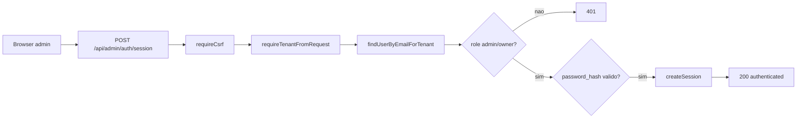
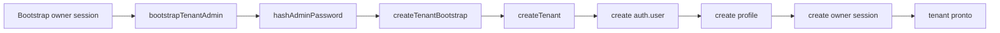
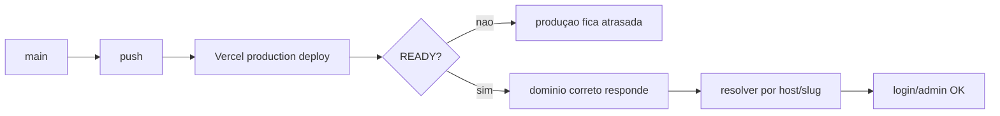

# Auditoria Completa v2 — Receitas Bell

**Projeto:** Receitas Bell  
**Data da auditoria:** 2026-04-01  
**Trilha:** C — Auditar e melhorar  
**Estado desejado:** produção estável, autenticação admin funcional, somente `main`, deploy válido e domínio correto  
**Assinatura:** Desenvolvido por MtsFerreira — mtsferreira.dev

---

## 1. Checklist roadmap aplicado

| Item | Status | Evidência | Impacto | Ação recomendada | Prioridade |
|---|---|---|---|---|---|
| Guia mestre v2.0 carregado e usado como fonte principal | OK | guia mestre carregado fileciteturn47file1 | garante formato e protocolo corretos | manter F0–F9 e 13 seções | P0 |
| Fonte complementar de APIs carregada | OK | catálogo de APIs carregado fileciteturn47file0 | útil para integrações futuras e compliance | manter como referência, não como fonte primária do projeto | P3 |
| Repositório está só com `main` | OK | inspeção direta do GitHub: branch única `main` | atende política main-only | manter branch única | P0 |
| README confirma stack e arquitetura multi-tenant | OK | README do projeto fileciteturn51file3 | valida topologia do backend | usar como contexto, não como verdade operacional absoluta | P1 |
| `package.json` define Node 20.x e gate mínimo | OK | `package.json` inspecionado fileciteturn31file0 | baseline de build/teste definido | manter Vercel alinhada em 20.x | P0 |
| Vercel já está com Node 20.x | OK | inspeção direta do projeto Vercel | remove drift de runtime | manter travado em 20.x | P0 |
| Último deploy de produção está cancelado | NOK | inspeção direta da Vercel: latest deployment `CANCELED` | produção pode estar atrás do código da `main` | executar novo deploy válido e smoke completo | P0 |
| Domínio `receitasbell.vercel.app` não aparece mais no projeto Vercel | NOK | inspeção direta da Vercel mostra apenas `receitasbell-matdev.vercel.app` e `receitasbell-git-main-matdev.vercel.app` | host/tenant pode falhar em produção real | reanexar domínio correto ou atualizar tenant host | P0 |
| Tenant resolution por slug/host continua correta no código | OK | `resolver.ts` + testes fileciteturn39file0 fileciteturn51file2 fileciteturn51file7 | fluxo admin depende disso | preservar contrato | P0 |
| `createTenantBootstrap` recebeu correção para criar auth user real | OK | testes de admin/bootstrap já validam `adminPasswordPlain` fileciteturn51file5 | reduz recorrência do bug | confirmar arquivo real e deployar | P0 |
| `createUser` foi corrigido para persistir `id/password_hash/legacy_password` | OK | dossiê implantado no repo documenta patch aplicado fileciteturn52file2 | corrige vínculo auth/profile | validar runtime em produção | P0 |
| Signup sem trigger implícita foi documentado como corrigido | OK | dossiê implantado no repo descreve patch em `signup-password` fileciteturn52file4 | evita erro de cadastro por trigger ausente | confirmar smoke funcional | P1 |
| Admin auth tem testes cobrindo login com hash, legado, host e tenant único | OK | testes `admin-auth.test.ts` fileciteturn51file0 fileciteturn51file5 fileciteturn51file17 | aumenta confiança na correção | manter e ampliar smoke | P0 |
| Guard de admin bloqueia token mestre em produção | OK | `admin-guards.test.ts` + doc security fileciteturn51file4 fileciteturn51file1 | reduz bypass perigoso | manter | P0 |
| Cliente frontend injeta `X-Tenant-Slug` e CSRF automaticamente | OK | `client.ts` fileciteturn51file9 | requisito para login/admin | manter | P0 |
| Página admin trata bootstrap, login e estado inicial | OK | `LoginPage.tsx` fileciteturn51file8 fileciteturn51file10 | ajuda a localizar falhas UX/fluxo | manter smoke visual | P1 |
| Existe `admin@receitasbell.com` em `auth.users` | OK | inspeção direta Supabase | admin já foi recuperado no auth | não recriar duplicado | P0 |
| Existe `admin@receitasbell.com` em `public.profiles` com `role=owner` | OK | inspeção direta Supabase | login admin tem base de dados válida | validar tenant correto | P0 |
| `password_hash` do admin existe | OK | inspeção direta Supabase | autenticação por hash pode funcionar | smoke de login obrigatório | P0 |
| Existem 3 tenants ativos no banco | OK | inspeção direta Supabase | fluxo sem contexto cai em ambiguidade | exigir host/slug correto sempre | P0 |
| Tenant legado `default` continua ativo | NOK | inspeção direta Supabase | pode causar resolução ambígua/risco operacional | desativar ou documentar uso | P1 |
| Tenant preview continua ativo | NOK | inspeção direta Supabase | pode interferir em fallback de tenant único e operação | desativar em produção se não necessário | P1 |
| Como há múltiplos tenants, login sem contexto deve falhar | OK | teste `admin-auth.test.ts` cobre caso fileciteturn51file17 | comportamento esperado | sempre usar host/slug corretos | P0 |
| CI workflow não foi confirmado | PENDENTE | não localizado nesta auditoria | risco de push sem gate real | localizar ou criar workflow | P1 |
| Há dossiê operacional no repo com status parcialmente desatualizado | NOK | `IMPLANTAR/dossie-agente-executor-receitasbell.md` ainda fala em branch extra e Vercel 24.x fileciteturn52file0 | pode induzir executor ao erro | substituir por dossiê atualizado | P1 |
| Health checks operacionais existem em testes | OK | `operational.spec.ts` fileciteturn51file18 | bom para smoke pós-deploy | executar em produção após deploy | P1 |
| PWA/admin offline flow existe e depende da sessão admin | OK | `RequirePwaAdminAuth.tsx` e `PwaEntryPage.tsx` fileciteturn51file14 fileciteturn51file15 | qualquer quebra em sessão impacta PWA admin | incluir smoke PWA depois | P2 |

---

## 2. Snapshot do backend

### F0 — Kickoff

#### FATO
- O guia mestre exige F0–F9, trilha única e entrega em 13 seções. fileciteturn47file1
- O projeto é multi-tenant, usa Vite, TypeScript, Supabase e Vercel. fileciteturn51file3 fileciteturn31file0
- O frontend envia `X-Tenant-Slug` e `X-CSRF-Token` nas mutações automaticamente. fileciteturn51file9
- O backend resolve tenant por `x-tenant-slug`, por host e, se houver exatamente um tenant ativo, faz fallback. Com múltiplos tenants ativos, exige contexto explícito. fileciteturn39file0 fileciteturn51file17
- Os testes atuais cobrem login admin com hash, migração de senha legada, login por host exato e falha sem contexto quando há múltiplos tenants. fileciteturn51file0 fileciteturn51file5 fileciteturn51file17

#### FATO — inspeção direta nos conectores
- GitHub: somente branch `main`.
- Vercel: Node `20.x`; último deploy de produção cancelado; domínios atuais listados não incluem `receitasbell.vercel.app`.
- Supabase: há 3 tenants ativos; 1 usuário auth (`admin@receitasbell.com`); 1 profile admin (`owner`) com `password_hash` presente.

#### SUPOSIÇÃO
- As correções de código documentadas no repositório já estão presentes na `main`, mas ainda não necessariamente publicadas em produção via deploy válido.
- O problema residual mais provável agora é operacional: domínio/host e deploy cancelado, não mais ausência de admin no banco.

#### [PENDENTE]
- Confirmar com um smoke real em produção qual domínio está servindo a build correta.
- Confirmar se o domínio `receitasbell.vercel.app` deve continuar existindo ou foi substituído definitivamente.
- Confirmar workflow CI/CD ativo fora dos arquivos inspecionados.

### Stack e runtime
- Node.js `20.x` no projeto. fileciteturn31file0
- Vite + React + TypeScript. fileciteturn31file0 fileciteturn51file3
- Supabase como banco/identity. fileciteturn34file0 fileciteturn51file3
- Vercel Functions / rotas `/api/*`. fileciteturn35file0 fileciteturn36file0
- Vitest + Playwright. fileciteturn31file0

### Como roda
- `npm run dev`, `npm run build`, `npm run gate`, `npm run test:unit`, `npm run test:e2e`. fileciteturn31file0
- Dev server do Vite embute handlers de API em SSR local. fileciteturn43file0

### Módulos principais
- `src/server/admin/*` — auth, guards e fluxo admin. fileciteturn37file0 fileciteturn51file6
- `src/server/tenancy/*` — resolução e repositório de tenants. fileciteturn39file0 fileciteturn40file0
- `src/server/auth/sessions.ts` — sessão cookie + fallback persistente/stateless. fileciteturn42file0
- `api_handlers/auth/signup-password.ts` — signup por senha. fileciteturn38file0
- `src/lib/api/*` — cliente do frontend com tenant e CSRF. fileciteturn51file9 fileciteturn51file16

### Dados sensíveis / PII mapping mínimo
- `email`, `userId`, `tenantId`, `role`, `password_hash`, `legacy_password` no domínio de auth/admin. fileciteturn37file0 fileciteturn42file0
- Segredos críticos em env: `SUPABASE_SERVICE_ROLE_KEY`, `APP_COOKIE_SECRET`, `ADMIN_API_SECRET`, `ENCRYPTION_KEY`, `STRIPE_SECRET_KEY`, `UPSTASH_REDIS_REST_TOKEN`. fileciteturn33file0 fileciteturn44file0

### Supply chain posture
- Gate mínimo existe no `package.json`. fileciteturn31file0
- CI workflow e pinning por SHA ainda não confirmados nesta passada. [PENDENTE]

### Compliance posture
- PII clara em auth/admin; guia exige LGPD/GDPR checklist e masking em logs. fileciteturn47file1
- Não foi confirmada política de retenção nem mapeamento formal em `/backend/compliance`. [PENDENTE]

---

## 3. Trilha escolhida

**TRILHA C — Auditar e melhorar**

### Justificativa
O backend já existe, tem rotas, sessões, tenancy, documentação operacional, testes e deploy em Vercel. O trabalho atual é fechar gaps de confiabilidade operacional e alinhar produção com o código já corrigido. Isso encaixa exatamente em auditoria + correções incrementais, não em criação do zero. fileciteturn47file1 fileciteturn51file3

---

## 4. Top 3 fluxos críticos

### Fluxo 1 — Login admin por tenant



**FATO**
- Handler admin exige CSRF em `POST`. fileciteturn36file0
- O cliente frontend já injeta `X-Tenant-Slug` e CSRF. fileciteturn51file9
- Há testes cobrindo hash, host, tenant único e falha por múltiplos tenants. fileciteturn51file0 fileciteturn51file17

**Pontos de falha**
- host/slug ausente com múltiplos tenants ativos → falha esperada.
- domínio/host incorreto na Vercel → tenant errado ou não resolvido.
- deploy cancelado → produção pode rodar código anterior.

**Impacto**
- painel admin inacessível.
- PWA admin e fluxos de sessão também sofrem. fileciteturn51file14 fileciteturn51file15

**Protocolo de não-quebra**
- não alterar contrato HTTP.
- corrigir infraestrutura/host antes de mexer de novo em auth.
- smoke sempre com host e tenant explícitos.

---

### Fluxo 2 — Bootstrap do primeiro tenant com owner



**FATO**
- Testes atuais já validam que `bootstrapTenantAdmin` repassa `adminPasswordPlain` para `createTenantBootstrap`. fileciteturn51file5

**Pontos de falha**
- se produção ainda roda build anterior, esse patch não está ativo.
- se domínio/host padrão mudar, o tenant criado pode nascer com host não desejado.

**Impacto**
- novos ambientes/tenants podem voltar a nascer quebrados.

**Protocolo de não-quebra**
- não remover compatibilidade do bootstrap.
- qualquer ajuste adicional deve ser aditivo.
- validar em staging/preview antes de novo bootstrap real.

---

### Fluxo 3 — Deploy de produção e resolução por host



**FATO**
- último deploy de produção está `CANCELED` na Vercel.
- os domínios listados hoje não incluem `receitasbell.vercel.app`.
- banco ainda aponta tenant principal para `receitasbell.vercel.app`.

**Pontos de falha**
- host do banco e host da Vercel divergirem.
- produção permanecer no commit `877fd9...` enquanto a `main` já tem correções mais novas.

**Impacto**
- comportamento diferente entre repo e produção.
- incidentes “fantasma”: código parece certo, mas ambiente responde errado.

**Protocolo de não-quebra**
- não redeployar cegamente.
- primeiro alinhar domínio/host.
- depois deployar e só então validar login.

---

## 5. Achados priorizados P0–P3

### P0 — Produção não está comprovadamente no código corrigido

**Problema**
O último deploy de produção na Vercel está cancelado, então não há garantia de que a produção esteja rodando os commits que corrigiram admin/bootstrap.

**Onde**
Infra Vercel do projeto `receitasbell`.

**Evidência**
Inspeção direta na Vercel: latest deployment `CANCELED`; últimos deploys com commits posteriores ao deploy `READY` conhecido.

**Impacto**
Código auditado pode estar correto, mas produção continua quebrada.

**Causa provável**
Pushs recentes não completaram o deploy de produção.

**Correção passo a passo**
1. identificar o SHA desejado na `main`
2. disparar novo deploy de produção
3. validar domínio principal
4. executar smoke admin

**Comandos**
```bash
git checkout main
git fetch origin --prune
git pull origin main
git rev-parse HEAD
npm run gate
```

**Critério de aceite**
- [ ] deploy de produção com status `READY`
- [ ] SHA do deploy corresponde ao HEAD da `main`
- [ ] smoke admin passa

**Como validar**
- abrir deployment na Vercel e conferir status `READY`
- conferir SHA do commit implantado

**Risco**
Médio.

**Rollback**
Redeploy do último deployment `READY` anterior ou `git revert HEAD`.

**Feature flag**
Não.

**Reversibilidade**
Alta.

**Protocolo de não-quebra**
Deploy só após `npm run gate` e smoke.

---

### P0 — Host do tenant principal diverge dos domínios ativos na Vercel

**Problema**
O tenant principal no banco usa `receitasbell.vercel.app`, mas a Vercel hoje lista apenas `receitasbell-matdev.vercel.app` e `receitasbell-git-main-matdev.vercel.app`.

**Onde**
`public.organizations.host` versus configuração atual da Vercel.

**Evidência**
Inspeção direta no Supabase e na Vercel.

**Impacto**
Resolução por host pode falhar no acesso real ao admin, mesmo com usuário válido.

**Causa provável**
Domínio removido/desconectado da Vercel sem sincronizar o banco.

**Correção passo a passo**
Escolher uma das duas estratégias, sem misturar:

**Estratégia A — restaurar domínio antigo na Vercel**
1. reanexar `receitasbell.vercel.app` ao projeto
2. manter `organizations.host = receitasbell.vercel.app`
3. redeployar produção

**Estratégia B — atualizar banco para o domínio vigente**
1. escolher domínio definitivo
2. atualizar `organizations.host` do tenant `receitasbell`
3. ajustar smoke e documentação
4. redeployar produção

**SQL de correção (caso estratégia B)**
```sql
update public.organizations
set host = 'receitasbell-matdev.vercel.app'
where slug = 'receitasbell';
```

**Critério de aceite**
- [ ] domínio do tenant e domínio da Vercel são o mesmo
- [ ] login por host funciona
- [ ] testes de resolução por host permanecem válidos

**Como validar**
```bash
curl -I https://DOMINIO_ESCOLHIDO/api/health/live
```
Esperado: `200`.

**Risco**
Alto, porque mexe com entrypoint da produção.

**Rollback**
Voltar o `host` anterior no banco ou reanexar o domínio antigo.

**Feature flag**
Não.

**Reversibilidade**
Média.

**Protocolo de não-quebra**
Escolher um único host final e validar antes de mudar links/UI.

---

### P0 — Estado multi-tenant do banco exige contexto explícito sempre

**Problema**
Há 3 tenants ativos; portanto, qualquer expectativa de fallback automático sem `X-Tenant-Slug`/host único é inválida.

**Onde**
Banco `public.organizations` + `resolver.ts`. fileciteturn39file0 fileciteturn51file17

**Impacto**
Chamadas sem contexto podem falhar e parecer bug de auth.

**Causa provável**
Existência de tenants `default` e `receitasbell-preview` ativos.

**Correção passo a passo**
1. classificar tenants ativos em produção
2. desativar os que não devem participar do runtime principal
3. manter preview isolado

**SQL sugerido para desativar tenants não-prod (após confirmação)**
```sql
update public.organizations
set is_active = false
where slug in ('default', 'receitasbell-preview');
```

**Critério de aceite**
- [ ] somente tenants necessários seguem ativos
- [ ] fallback de tenant único só existe se intencional
- [ ] documentação operacional atualizada

**Risco**
Médio.

**Rollback**
```sql
update public.organizations
set is_active = true
where slug in ('default', 'receitasbell-preview');
```

**Feature flag**
Não.

**Reversibilidade**
Alta.

**Protocolo de não-quebra**
Confirmar que nenhum fluxo de preview depende desses tenants antes de desativar.

---

### P1 — Dossiê dentro do repositório está desatualizado

**Problema**
O arquivo `IMPLANTAR/dossie-agente-executor-receitasbell.md` registra fatos que já mudaram: branch secundária, Vercel 24.x e pendências já resolvidas parcialmente. fileciteturn52file0

**Impacto**
O executor pode repetir passos ou aplicar rollback desnecessário.

**Correção**
Substituir o dossiê antigo por este atualizado.

**Critério de aceite**
- [ ] só existe um dossiê vigente
- [ ] fatos operacionais refletem estado atual

**Risco**
Baixo.

**Rollback**
Restaurar versão anterior via Git.

---

### P1 — Workflow CI não confirmado

**Problema**
Não foi localizado workflow de CI nesta auditoria.

**Impacto**
Push para `main` pode depender apenas de disciplina manual.

**Correção**
Criar `.github/workflows/ci.yml` fixado por SHA com `npm ci`, `lint`, `typecheck`, `build`, `test:unit`.

**Critério de aceite**
- [ ] todo push/PR dispara pipeline
- [ ] falha bloqueia merge

**Risco**
Baixo.

---

### P2 — Ausência de verificação operacional explícita de PWA/admin após correção

**Problema**
Há fluxo offline/admin PWA, mas a auditoria anterior focou só em browser admin. fileciteturn51file14 fileciteturn51file15

**Impacto**
Pode haver regressão silenciosa no PWA.

**Correção**
Adicionar smoke PWA admin após deploy.

**Critério de aceite**
- [ ] `/pwa/entry` resolve corretamente
- [ ] admin offline lock screen continua funcional

---

## 6. Arquitetura e contratos propostos

### Estrutura
Manter a estrutura atual e exigir pasta `/backend` conforme guia. fileciteturn47file1

### Contratos críticos preservados
- `GET /api/admin/auth/session`
- `POST /api/admin/auth/session`
- `DELETE /api/admin/auth/session` fileciteturn36file0

### AuthN/AuthZ
- browser admin via sessão real + CSRF. fileciteturn51file1
- sem bypass global por `ADMIN_API_SECRET` em produção. fileciteturn51file4 fileciteturn51file6
- tenant-scoped resolution por slug/host. fileciteturn39file0

### Timeouts por dependência
| Dependência | Timeout | Retry | Observação |
|---|---:|---:|---|
| Supabase Auth/Admin | 5s | 1 | writes sem retry agressivo |
| Supabase DB | 5s | 0 | falha rápida |
| Upstash Redis | 500ms | 1 | somente leitura idempotente |
| Stripe | 10s | 2 com jitter | quando aplicável |
| Sentry | 2s | 0 | assíncrono |

### Rate limiting
- manter rate limiting já previsto para rotas críticas; revisar headers padronizados em fase 2.

### Versionamento e deprecação
- não mudar contrato agora.
- documentar no OpenAPI 3.1 em `/backend/contracts/openapi.yaml`.

### Logging mínimo obrigatório
- `timestamp`
- `level`
- `action`
- `requestId`
- `correlationId`
- `tenantId`
- `userId`
- `latencyMs`
- `outcome`

---

## 7. Plano de implementação por fases

### Fase 0 — Atualizar documentação operacional
**Objetivo:** substituir o dossiê antigo pelo atual.

**Arquivos-alvo:**
- `IMPLANTAR/dossie-agente-executor-receitasbell.md`
- `/backend/handoff/execucao-final.md`

**Comandos**
```bash
git checkout main
git pull origin main
```

**Critério de aceite**
- [ ] dossiê reflete branch única, Node 20.x, admin existente e deploy cancelado

**Rollback**
```bash
git checkout -- IMPLANTAR/dossie-agente-executor-receitasbell.md
```

---

### Fase 1 — Resolver domínio definitivo do tenant principal
**Objetivo:** alinhar Vercel e banco.

**Arquivos / recursos-alvo:**
- Vercel project domains
- `public.organizations.host`

**Passos exatos**
1. decidir domínio final
2. alinhar Vercel
3. alinhar `organizations.host`
4. validar healthcheck pelo host final

**Comandos / SQL**
```sql
select id, slug, host, is_active from public.organizations order by created_at;
```

Se optar por atualizar o banco:
```sql
update public.organizations
set host = 'DOMINIO_FINAL'
where slug = 'receitasbell';
```

**Critério de aceite**
- [ ] domínio final responde
- [ ] tenant principal usa o mesmo host do projeto

**Rollback**
Voltar host anterior.

---

### Fase 2 — Deploy de produção válido
**Objetivo:** publicar a `main` corrigida.

**Comandos**
```bash
npm run gate
git rev-parse HEAD
```

**Passo operacional**
- disparar deploy de produção na Vercel para o HEAD da `main`.

**Critério de aceite**
- [ ] deployment `READY`
- [ ] SHA do deploy = SHA do HEAD local/remoto

**Rollback**
- redeploy do último `READY` anterior
- ou `git revert HEAD`

---

### Fase 3 — Smoke do admin por slug e por host
**Objetivo:** provar que auth e tenant resolution funcionam na produção real.

**Comandos**
```bash
curl -i \
  -H "Content-Type: application/json" \
  -H "X-Tenant-Slug: receitasbell" \
  -H "X-CSRF-Token: teste" \
  --cookie "__Host-rb_csrf=teste" \
  -d '{"email":"admin@receitasbell.com","password":"SENHA_REAL"}' \
  https://DOMINIO_FINAL/api/admin/auth/session
```

Depois testar health:
```bash
curl -i https://DOMINIO_FINAL/api/health/live
curl -i https://DOMINIO_FINAL/api/health/ready
```

**Critério de aceite**
- [ ] login admin `200`
- [ ] health live `200`
- [ ] ready `200` ou `503` controlado com corpo válido fileciteturn51file18

**Rollback**
Reverter deploy/domínio.

---

### Fase 4 — Limpeza de tenants não-prod
**Objetivo:** remover ambiguidade operacional.

**SQL (somente após confirmação)**
```sql
update public.organizations
set is_active = false
where slug in ('default', 'receitasbell-preview');
```

**Critério de aceite**
- [ ] apenas tenants necessários seguem ativos
- [ ] comportamento esperado documentado

**Rollback**
```sql
update public.organizations
set is_active = true
where slug in ('default', 'receitasbell-preview');
```

---

### Fase 5 — Criar ou confirmar CI mínimo
**Objetivo:** impedir regressão silenciosa na `main`.

**Arquivo-alvo**
- `.github/workflows/ci.yml`

**Conteúdo mínimo**
```yaml
name: ci
on:
  push:
    branches: [main]
  pull_request:

jobs:
  quality:
    runs-on: ubuntu-latest
    steps:
      - uses: actions/checkout@b4ffde65f46336ab88eb53be808477a3936bae11
      - uses: actions/setup-node@60edb5dd545a775178f52524783378180af0d1f8
        with:
          node-version: 20
          cache: npm
      - run: npm ci
      - run: npm run lint
      - run: npm run typecheck
      - run: npm run build
      - run: npm run test:unit
```

**Critério de aceite**
- [ ] workflow dispara em push para `main`
- [ ] gate verde antes de novo deploy

---

## 8. Observabilidade, testes e CI/CD

### Logs
- manter JSON logs estruturados.
- garantir `requestId` + `correlationId`.
- mascarar PII conforme guia. fileciteturn47file1

### Métricas mínimas
- `admin_login_success_total`
- `admin_login_failure_total`
- `tenant_resolution_failure_total`
- `session_create_failure_total`
- `health_ready_status_total`

### Testes relevantes já vistos
- `admin-auth.test.ts` cobre login/host/multi-tenant/bootstrap. fileciteturn51file0 fileciteturn51file5 fileciteturn51file17
- `admin-guards.test.ts` cobre bloqueio de token mestre em produção. fileciteturn51file4
- `tenant-resolution.test.ts` cobre header/host/not found. fileciteturn51file7
- `operational.spec.ts` cobre health e headers. fileciteturn51file18

### Gaps
- smoke real de produção ainda não comprovado nesta auditoria.
- CI workflow não confirmado.

### SBOM / scans
- exigidos pelo guia como fase seguinte; não confirmados nesta passada. fileciteturn47file1

---

## 9. Runbooks e operação

### Deploy
1. `npm run gate`
2. push na `main`
3. deploy de produção na Vercel
4. validar `READY`
5. smoke admin + health

### Rollback
```bash
git revert HEAD
git push origin main
```
ou redeploy do último deployment `READY`.

### Troubleshooting tree
- **401 no admin** → validar host/slug → validar cookie CSRF → validar profile/admin no banco → validar build da produção.
- **404 tenant not found** → validar `organizations.host` e domínio Vercel.
- **build certo, login errado** → verificar se produção está no SHA esperado.

### Incidente IMAG
- IC: responsável pelo rollout
- Ops Lead: GitHub/Vercel/Supabase
- Comms Lead: atualização operacional

### Disaster recovery
- snapshot lógico antes de desativar tenants
- backup de `organizations`, `profiles`, `auth_sessions`
- registrar domínio/host anterior antes de qualquer troca

---

## 10. Artefatos gerados ou exigidos

### Já existentes
- `IMPLANTAR/dossie-agente-executor-receitasbell.md` — **desatualizado**, substituir. fileciteturn52file0
- docs de segurança admin. fileciteturn51file1
- testes unitários/operacionais. fileciteturn51file0 fileciteturn51file18

### Exigidos
- `/backend/handoff/execucao-final.md`
- `/backend/handoff/previsao-falhas-futuras.md`
- `/backend/runbooks/deploy-e-rollback.md`
- `/backend/runbooks/troubleshooting.md`
- `.github/workflows/ci.yml`
- `/backend/compliance/pii-mapping.md`

---

## 11. Suposições e [PENDENTE]

1. **SUPOSIÇÃO:** os patches documentados já estão na `main`.  
   **Risco:** produção ainda não implantada.  
   **Reversibilidade:** alta.  
   **Prazo:** resolver no próximo deploy.

2. **SUPOSIÇÃO:** o admin atual usa a senha já definida pelo recovery recente.  
   **Risco:** smoke falhar por credencial divergente.  
   **Reversibilidade:** alta.  
   **Prazo:** resolver no smoke imediato.

3. **[PENDENTE]:** domínio final de produção.  
   **Risco:** tenant resolution quebrar mesmo com código certo.  
   **Reversibilidade:** média.  
   **Prazo:** antes do próximo deploy.

4. **[PENDENTE]:** workflow CI real.  
   **Risco:** regressão entrar na `main`.  
   **Reversibilidade:** alta.  
   **Prazo:** nesta mesma rodada de hardening.

5. **SUPOSIÇÃO:** tenants `default` e `preview` não são necessários na produção principal.  
   **Risco:** desativar algo ainda usado.  
   **Reversibilidade:** alta.  
   **Prazo:** validar antes do SQL.

---

## 12. Previsão de falhas futuras

### 3 meses
- novo incidente operacional por host/domínio desalinhado.
- login falhar “aleatoriamente” em ambientes diferentes por falta de smoke em domínio final.
- drift entre código e Vercel reaparecer se deploy cancelado passar despercebido.

### 1 ano
- multiplicação de tenants ativos “sobrando” causar resolução ambígua e suporte difícil.
- dívida em CI/security scanning permitir regressões em auth.
- documentação operacional no repo envelhecer mais rápido que a infra real.

### 3 anos
- auth, tenancy e sessão precisarem separação mais explícita por bounded context.
- exigências de compliance e auditoria pedirem retenção formal, trilha de exclusão e masking automatizado.
- governança de domínios/preview environments virar fonte recorrente de bugs se não padronizar naming e lifecycle.

---

## 13. Handoff final para o Agente Executor

1. Substitua o dossiê antigo do repositório por este atualizado.
2. Confirme qual é o domínio final de produção do projeto `receitasbell`.
3. Alinhe a Vercel e o campo `organizations.host` do tenant `receitasbell` para o mesmo domínio.
4. Rode `npm run gate` na `main`.
5. Faça deploy de produção do HEAD atual da `main`.
6. Confirme que o deployment ficou `READY`.
7. Rode o smoke do admin com `X-Tenant-Slug: receitasbell` e CSRF.
8. Rode `curl` em `/api/health/live` e `/api/health/ready` no domínio final.
9. Se o domínio estiver certo e o login passar, marque o incidente como resolvido.
10. Avalie desativar os tenants `default` e `receitasbell-preview` se não forem necessários.
11. Confirme ou crie workflow CI mínimo em `.github/workflows/ci.yml`.
12. Se qualquer etapa falhar, reverta o deploy ou faça `git revert HEAD` e redeploy.

