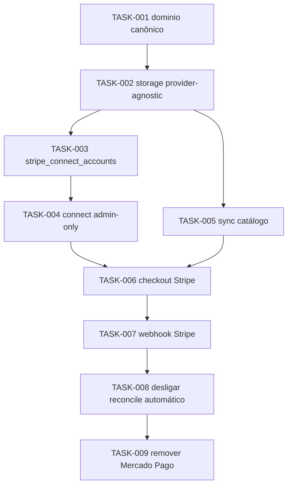

# DAG de dependências

```mermaid
flowchart TD
  T1[TASK-001 dominio canônico]
  T2[TASK-002 storage provider-agnostic]
  T3[TASK-003 stripe_connect_accounts]
  T4[TASK-004 connect admin-only]
  T5[TASK-005 sync catálogo]
  T6[TASK-006 checkout Stripe]
  T7[TASK-007 webhook Stripe]
  T8[TASK-008 desligar reconcile automático]
  T9[TASK-009 remover Mercado Pago]

  T1 --> T2
  T2 --> T3
  T3 --> T4
  T2 --> T5
  T4 --> T6
  T5 --> T6
  T6 --> T7
  T7 --> T8
  T8 --> T9
```
