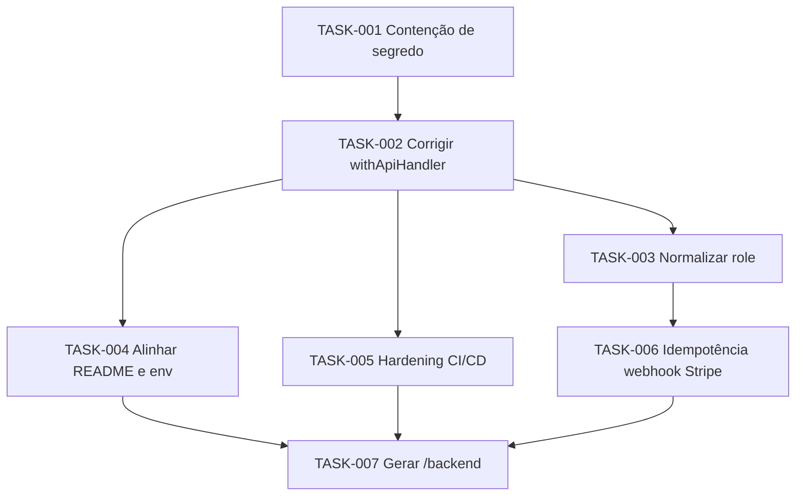

# 02 — Task Dependency Graph

```mermaid
flowchart TD
  T1[TASK-001 Contenção de segredo] --> T2[TASK-002 Corrigir withApiHandler]
  T2 --> T3[TASK-003 Normalizar role]
  T2 --> T4[TASK-004 Alinhar README e env]
  T2 --> T5[TASK-005 Hardening CI/CD]
  T3 --> T6[TASK-006 Idempotência webhook Stripe]
  T4 --> T7[TASK-007 Gerar /backend]
  T5 --> T7
  T6 --> T7
```

---
**Desenvolvido por MtsFerreira** — https://mtsferreira.dev

