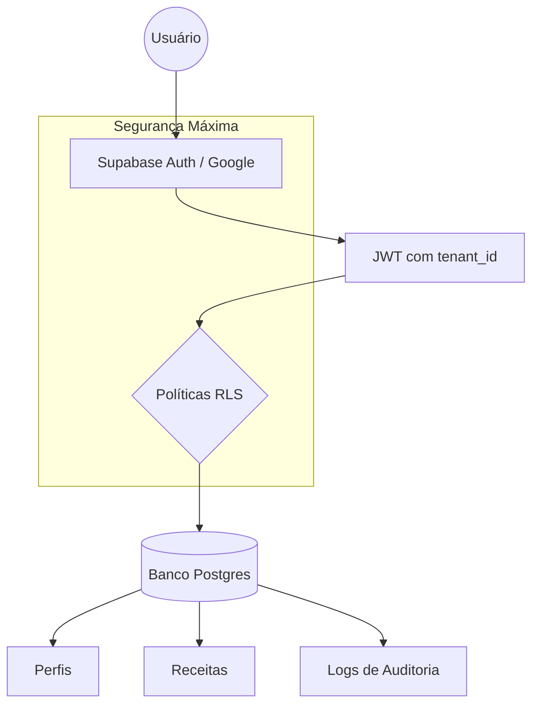

# 🦊 Receitasbell - Estratégia de Potencial Máximo (Supabase 100%)

Este documento apresenta a solução final desenhada pela inteligência artificial para transformar o **Receitasbell** em uma plataforma ultra-segura, escalável e de nível profissional, utilizando todo o poder do Supabase.

## 🏗️ Visão Geral da Arquitetura

A nova infraestrutura abandona o Baserow em favor do **Supabase (PostgreSQL nativo)**, permitindo o uso de Row Level Security (RLS) para garantir que os dados estejam protegidos no nível do banco de dados, e não apenas no código da aplicação.

## 🔐 Pilares da Segurança "Zero-Flaw"

1.  **Identity-First Security:** O login via Google será a âncora de identidade. Nenhuma ação pode ser tomada sem um JWT válido.
2.  **Strict RLS:** Cada tabela possui políticas de acesso que verificam o `tenant_id`. Mesmo se um atacante conseguir a chave anônima, ele **não conseguirá ler dados de outros usuários**.
3.  **Auditoria Nativa:** Todas as alterações críticas são registradas na tabela `audit_logs`, garantindo rastreabilidade total.

## 📝 O Novo Esquema (Supabase)

O arquivo [supabase_hardened_schema.sql](file:///d:/MATEUS/Documentos/GitHub/receitasbell/supabase_hardened_schema.sql) foi criado com a estrutura completa. Ele define:
- **Multi-tenancy:** Suporte a múltiplas organizações (se necessário).
- **Tipagem Forte:** Uso de UUIDs, JSONB e Timestamptz.
- **Auto-Update:** Triggers que gerenciam datas de atualização sem intervenção do código.

## 🚀 Próximos Passos de Implementação

### 1. Configuração do Google Auth
Para ativar o login 100% potente:
1. Acesse o [Google Cloud Console](https://console.cloud.google.com/).
2. Crie um projeto OAuth 2.0.
3. Insira as credenciais no [Painel do Supabase](https://supabase.com/dashboard/project/ixfwvaszmngbyxrdiaha/auth/providers).
4. **Eu posso guiar você passo a passo pelo navegador se precisar.**

### 2. Migração do Baserow
Dada a lista de tabelas atuais no Baserow, podemos automatizar a migração:
- Exportar IDs e dados atuais.
- Mapear para o novo esquema SQL.
- Importar via script CLI do Supabase.

### 3. Integração de E-mail Automático
Utilizaremos **Edge Functions** com o provedor **Resend**:
- Disparo de e-mail de "Boas-vindas" ao criar perfil.
- Notificações de receitas compartilhadas.

---
> [!IMPORTANT]
> A segurança está configurada para ser "Negativa por Padrão". Isso significa que se uma política não for explicitamente criada, ninguém acessa nada. Isso elimina erros humanos de exposição de dados.

**Este plano está pronto para execução. Deseja que eu comece a aplicar o esquema SQL no seu projeto Supabase?**
