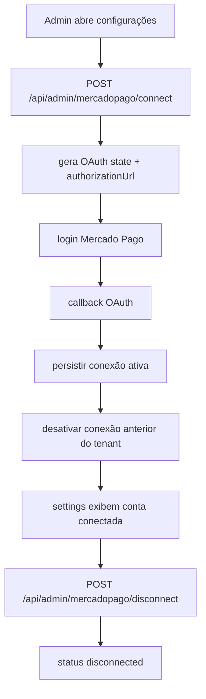
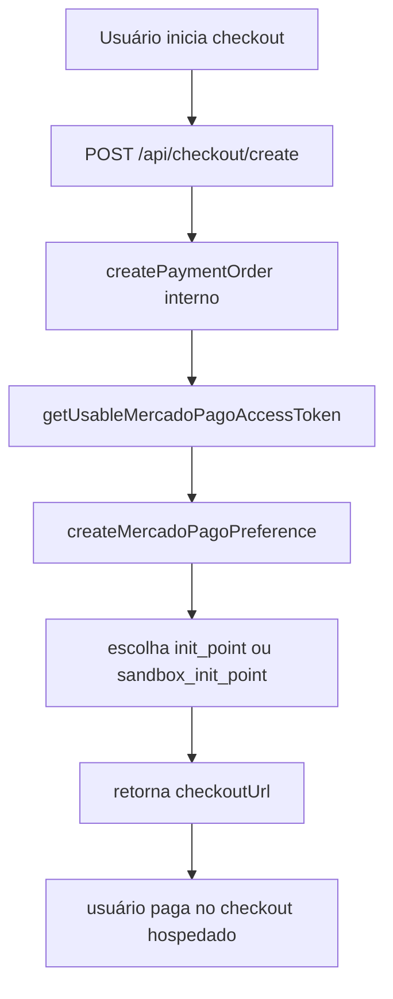
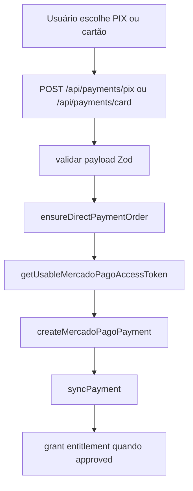

# Auditoria técnica — Receitas Bell / Mercado Pago / Vercel / Baserow

## 1. Checklist roadmap aplicado

| Item | Status | Evidência | Impacto | Ação | Prioridade |
|---|---|---|---|---|---|
| F0 — escopo auditado | OK | Repositório `mmatteuus/receitasbell`, projeto Vercel `receitasbell`, tabelas Baserow de pagamentos e conexão MP, repositório de referência `mercadopago/cart-woocommerce` | Base suficiente para diagnóstico | Consolidar em trilha única | P0 |
| F1 — checklist inicial | OK | Handlers admin, OAuth MP, conexão MP, checkout, pagamentos diretos, build Vercel, tabelas Baserow | Permite priorização por risco | Executar correções em ordem | P0 |
| F2 — scanner de arquivos críticos | OK | `vercel.json`, `package.json`, `env.ts`, `validators.ts`, `payments/service.ts`, `payments/direct.ts`, `connections.ts`, `oauth.ts` | Diagnóstico técnico consistente | Fixar pontos de quebra | P0 |
| F3 — mapa de rotas admin/payments | OK | `/api/admin/payments`, `/api/admin/payments/settings`, `/api/admin/mercadopago/connect`, `/api/admin/mercadopago/disconnect`, `/api/checkout/create`, `/api/payments/pix`, `/api/payments/card` | Fluxo atual mapeado | Tratar fluxos críticos | P0 |
| F3 — mapa de integrações | OK | Vercel + Baserow + Mercado Pago + Upstash rate limit + Sentry no frontend/backend | Superfície de falha identificada | Definir timeouts/retries e fallback | P0 |
| Conexão MP por tenant | NOK | Schema real do Baserow não está alinhado ao write path do código | 500, reconnect quebrado, troca de conta inconsistente | Alinhar schema + acesso | P0 |
| OAuth state compatível camel/snake | OK parcial | `oauth.ts` já possui fallback | Reduz parte do problema | Replicar padrão em `connections.ts` | P1 |
| Query de conexões por tenant | NOK | `connections.ts` consulta `tenant_id` e `tenantId` em loop cego | Pode gerar 400/500 por schema inválido | Implementar fallback seguro | P0 |
| Status real da conexão | NOK | `resolveConnectionStatus` assume `connected` quando só há token | Falso positivo operacional | Considerar `expires_at` e refresh | P1 |
| Troca de conta MP | OK parcial | Existe connect/disconnect/OAuth callback | Requisito principal quase atendido | Endurecer persistência e status | P0 |
| Métodos aceitos pelo produto | NOK | Domínio expõe `checkout_pro`, `pix`, `card` | Pode vazar ticket/boleto via checkout hospedado | Restringir política de métodos | P0 |
| PIX direto | OK | Endpoint e serviço dedicados | Fluxo principal disponível | Manter e reforçar testes | P0 |
| Cartão direto | OK parcial | Endpoint e serviço existem | Funciona, mas trata cartão como bucket genérico | Persistir `payment_type_id` real | P1 |
| Débito explícito | NOK | Sistema não diferencia crédito x débito no contrato interno | Relatórios/UI ambíguos | Salvar `payment_method_id` + `payment_type_id` | P1 |
| Ticket/boleto desabilitado | NOK | `checkout_pro` não restringe métodos no payload | Violação do requisito de produto | Desligar `checkout_pro` por padrão | P0 |
| Catálogo dinâmico do seller | NOK | Não existe sync explícito dos meios da conta conectada | UI pode prometer método indisponível | Implementar snapshot por tenant | P1 |
| Storage de pagamentos em env crítica | NOK | `BASEROW_TABLE_PAYMENT_ORDERS` não entra em `validateCriticalEnv()` | App sobe e quebra só em runtime | Tornar env crítica | P0 |
| Build de produção | NOK | Deploy recente quebra por tipagem Stripe | Nenhuma correção nova entra em produção | Corrigir build breaker | P0 |
| Limite plano grátis — Vercel | OK parcial | Arquitetura atual é serverless enxuta | Mantém custo baixo | Evitar filas/serviços extras | P2 |
| Limite plano grátis — Baserow | [PENDENTE] | Não validado por documentação oficial nesta sessão | Risco de extrapolar storage/rows futuramente | Revisão documental antes de expandir schema | P2 |
| PII map básico | OK parcial | E-mail, nome, CPF/CNPJ, tokens, user_id MP, IP, user-agent | Exige mascaramento e retenção | Formalizar política | P1 |
| Logs estruturados e auditoria | OK parcial | Há audit log e logger, mas pouca taxonomia operacional para MP | Troubleshooting lento | Padronizar logs e métricas | P1 |
| Tests de regressão para multi-conta | NOK | Não há cobertura explícita de switch account | Risco alto de quebra futura | Adicionar suíte dedicada | P0 |
| Runbook de reconnect/rotate | NOK | Fluxo existe, operação não está documentada | Incidente repetitivo | Criar runbook | P1 |
| Protocolo de não-quebra | NOK parcial | Não aplicado de ponta a ponta nas mudanças recentes | Regressões em produção | Feature flag + rollback por fase | P0 |

---

## 2. Snapshot do backend

### Stack e versões
- Front/back no mesmo projeto Vite + Vercel Functions.
- Node definido no `package.json` como `20.x`.
- Backend TS com `zod`, `@vercel/node`, `@upstash/ratelimit`, `@upstash/redis`, `@sentry/node`, `stripe`, `uuid`.
- Integração MP feita por HTTP direto, sem SDK dedicado do MP.

### Como roda
- **Serverless** na Vercel.
- Front estático + funções API em `api_handlers` e `api/...` com rewrites no `vercel.json`.
- Persistência operacional em **Baserow**.

### Módulos e rotas relevantes
- Admin:
  - `/api/admin/payments`
  - `/api/admin/payments/settings`
  - `/api/admin/mercadopago/connect`
  - `/api/admin/mercadopago/disconnect`
- Checkout e pagamento:
  - `/api/checkout/create`
  - `/api/payments/pix`
  - `/api/payments/card`
  - webhook de checkout/pagamentos

### Integrações com timeout/retry
- Mercado Pago: timeout de 10s com retry exponencial + jitter no client HTTP.
- Refresh OAuth MP: timeout 10s.
- Baserow: depende de wrapper interno; timeout de env já previsto.
- Upstash rate limit nas rotas públicas de checkout/pagamento.

### Dados sensíveis (PII map)
- PII direta: `buyerEmail`, `payerName`, `identification.number` (CPF/CNPJ), IP, user-agent.
- Segredos: `access_token`, `refresh_token`, `public_key`, `client_secret`, `webhook_secret`, `ENCRYPTION_KEY`.
- Dados operacionais sensíveis: `mercadoPagoUserId`, IDs de pagamento, correlation/request ids.

### Limitações da análise
- Não houve acesso à documentação oficial atual de limites do plano grátis do Baserow nesta sessão.
- Não houve acesso às env vars reais da Vercel por API mode porque `VERCEL_TOKEN` não estava disponível no runtime.
- O conector GitHub não permitiu gravar patch final diretamente no repositório nesta sessão.

### Compliance posture
- LGPD impacta diretamente CPF/CNPJ, e-mail, IP, user-agent, logs de auditoria e retenção.
- Há base mínima de auditoria, mas falta política explícita de retenção, mascaramento e deleção.

### Supply chain posture
- Há gate de build (`lint`, `typecheck`, `build`, `test:unit`).
- Há vulnerabilidades informadas no build da Vercel.
- Não há evidência operacional de SBOM, pin por SHA em workflows ou policy clara de dependências.

---

## 3. Trilha escolhida

### TRILHA C — Auditar e melhorar

**Justificativa**
- O backend já existe e já implementa parte relevante do fluxo OAuth, connect/disconnect, checkout e pagamentos diretos.
- O problema não é ausência de backend; é **inconsistência entre código, schema Baserow, política de produto e operação na Vercel**.
- A correção correta é **endurecer o que existe**, não reescrever do zero.

---

## 4. Top 3 fluxos críticos

### Fluxo 1 — Conectar / desconectar / trocar conta do Mercado Pago



**Pontos de falha**
- P0: schema Baserow incompatível com os campos que `connections.ts` grava.
- P0: query de conexão usando `tenantId` e `tenant_id` sem fallback seguro.
- P1: status pode continuar `connected` mesmo com token expirado.

**Dependências com timeout**
- OAuth token exchange MP: 10s.
- Refresh token MP: 10s.
- Baserow: timeout de wrapper/env.

**Impacto se falhar**
- 500 em settings.
- impossibilidade de trocar de conta sem sair da aplicação.
- reconexão falhando de forma intermitente.

**Protocolo de não-quebra para este fluxo**
- Não apagar registros de conexão; apenas marcar conexão antiga como `disconnected`.
- Alterar schema primeiro, depois código, depois reconnect assistido.
- Manter rollback por commit e por reversão dos campos Baserow adicionados.

### Fluxo 2 — Checkout hospedado (preference)



**Pontos de falha**
- P0: `checkout_pro` não restringe ticket/boleto no payload.
- P1: conta conectada pode não retornar URL compatível com `payment_mode`.
- P1: token rejeitado exige refresh/reconnect.

**Dependências com timeout**
- MP preference create: 10s + retry exponencial/jitter.
- Refresh/retry de conexão: 10s.

**Impacto se falhar**
- usuário vê método proibido pelo produto.
- criação do checkout falha com 409/500.
- operação real fica sujeita a comportamento da conta conectada.

**Protocolo de não-quebra para este fluxo**
- Desligar `checkout_pro` por feature flag antes de remover do front.
- Não remover endpoint imediatamente; marcar como desabilitado para produção.
- Só religar com whitelist testada por conta e país.

### Fluxo 3 — Pagamentos diretos PIX e cartão



**Pontos de falha**
- P0: storage de pagamentos pode não estar validado como env crítica.
- P1: cartão salvo como `credit_card` genérico, sem diferenciar débito.
- P1: config pública exibe `card` apenas com `publicKey`, sem catálogo dinâmico do seller.

**Dependências com timeout**
- MP payment create/get/cancel: 10s + retry/jitter.
- Baserow payment orders: timeout do wrapper/env.

**Impacto se falhar**
- 500 na área admin de pagamentos.
- UI promete método que a conta não suporta.
- relatórios e filtros não distinguem crédito/débito.

**Protocolo de não-quebra para este fluxo**
- Persistir novos campos de método de forma aditiva.
- Nunca reprocessar pagamento finalizado; usar idempotência já existente.
- Migrar leitura de admin primeiro, escrita depois, exibição por último.

---

## 5. Achados priorizados P0–P3

### P0-01 — Build de produção bloqueado por erro de tipagem no Stripe
**Problema**: deploy recente não sobe; o `main` novo não entra em produção.

**Onde**
- `src/server/integrations/stripe/client.ts`

**Evidência**
- O arquivo usa `Stripe.StripeError` em múltiplos `catch`.
- Os logs de build da Vercel já acusaram exatamente esse ponto como erro de compilação.

**Impacto**
- Nenhuma correção nova do backend entra em produção.
- O domínio pode continuar servindo um deployment antigo.

**Causa provável**
- Mudança de tipagem/SDK do Stripe incompatível com o código atual.

**Correção passo a passo**
1. Criar helper local de normalização de erro Stripe.
2. Remover cast direto para `Stripe.StripeError`.
3. Recompilar e validar `typecheck`.

**Snippet de código**
```ts
function normalizeStripeError(error: unknown) {
  if (!error || typeof error !== "object") {
    return { statusCode: 502, message: "Falha no Stripe.", code: undefined };
  }

  const record = error as Record<string, unknown>;
  return {
    statusCode: typeof record.statusCode === "number" ? record.statusCode : 502,
    message: typeof record.message === "string" ? record.message : "Falha no Stripe.",
    code: typeof record.code === "string" ? record.code : undefined,
  };
}

// uso
} catch (error: unknown) {
  const e = normalizeStripeError(error);
  throw new StripeApiError(e.statusCode, e.message, e.code);
}
```

**Critério de aceite**
- [ ] `npm run typecheck` passa.
- [ ] `npm run gate` passa localmente.
- [ ] novo deploy chega a `READY`.

**Como testar**
```bash
npm run typecheck
npm run gate
# Esperado: sem erro TS2724 em stripe/client.ts
```

**Risco de rollout**
- Baixo. Mudança de tratamento de erro sem alterar contrato funcional.

**Feature flag necessária?**
- Não.

**Reversibilidade**
- Alta. Revert simples do arquivo.

**Protocolo de não-quebra aplicável**
- Aplicar em branch isolada, validar build antes de qualquer merge para produção.

---

### P0-02 — Drift de schema entre `connections.ts` e Baserow real
**Problema**: a camada de conexão MP espera um schema mais rico do que o schema observado no Baserow; a query também tenta camelCase e snake_case em loop cego.

**Onde**
- `src/server/integrations/mercadopago/connections.ts`
- tabela `mercado_pago_connections` no Baserow

**Evidência**
- `connections.ts` lê/escreve `mercado_pago_user_id`, `access_token_encrypted`, `refresh_token_encrypted`, `status`, `connected_at`, `last_refresh_at`, `last_error`, `created_by_user_id`.
- `oauth.ts` já precisou de fallback camel/snake para state row, sinal claro de schema drift.

**Impacto**
- 500 em settings.
- reconnect quebrado.
- troca de conta instável.
- refresh e disconnect inconsistentes.

**Causa provável**
- Evolução parcial do código sem migração correspondente do Baserow.

**Correção passo a passo**
1. Adicionar no Baserow os campos faltantes na tabela de conexões.
2. Ajustar `queryTenantConnections()` para consultar `tenant_id` primeiro.
3. Só tentar `tenantId` se a primeira consulta falhar por schema, não em loop cego.
4. Revalidar connect/disconnect/reconnect.

**Snippet de código**
```ts
async function fetchConnectionRowsSafe(tableId: number, tenantValue: string) {
  try {
    return await fetchConnectionRows(tableId, "tenant_id", tenantValue);
  } catch (error) {
    if (!(error instanceof BaserowError) || error.status !== 400) throw error;
    return await fetchConnectionRows(tableId, "tenantId", tenantValue);
  }
}

async function queryTenantConnections(tenantId: string | number) {
  const tableId = requireConnectionsTableId();
  const tenantRecord = await getTenantById(tenantId).catch(() => null);
  const tenantKeys = new Set([String(tenantId)]);
  if (tenantRecord?.slug) tenantKeys.add(tenantRecord.slug);

  const rowsById = new Map<string, MercadoPagoConnectionRow>();
  for (const tenantKey of tenantKeys) {
    const rows = await fetchConnectionRowsSafe(tableId, tenantKey);
    for (const row of rows.results) {
      if (row.id != null) rowsById.set(String(row.id), row);
    }
  }

  return Array.from(rowsById.values()).sort((a, b) => Number(b.id || 0) - Number(a.id || 0));
}
```

**Critério de aceite**
- [ ] `/api/admin/payments/settings` retorna 200.
- [ ] connect e disconnect retornam 200.
- [ ] reconnect persiste a nova conta sem 500.

**Como testar**
```bash
curl -X POST https://SEU_HOST/api/admin/mercadopago/connect \
  -H 'Content-Type: application/json' \
  -H 'x-tenant-slug: receitasbell' \
  -b 'sua_sessao' \
  --data '{"returnTo":"/admin/pagamentos/configuracoes"}'
# Esperado: 200 com authorizationUrl
```

**Risco de rollout**
- Médio. Envolve schema + código.

**Feature flag necessária?**
- Sim, para leitura do schema novo (`MP_CONNECTIONS_SCHEMA_V2`).

**Reversibilidade**
- Média. Campos aditivos no Baserow são reversíveis; não remover dados antigos.

**Protocolo de não-quebra aplicável**
- Primeiro migrar schema, depois liberar leitura fallback, depois escrita enriquecida.

---

### P0-03 — `checkout_pro` pode expor boleto/ticket, contrariando a regra do produto
**Problema**: o domínio ainda aceita `checkout_pro`; a criação de preferência não restringe meios de pagamento no payload.

**Onde**
- `src/types/payment.ts`
- `src/server/payments/service.ts`

**Evidência**
- `CheckoutPaymentMethod = "checkout_pro" | "pix" | "card"`.
- `createCheckout()` monta a preferência sem `payment_methods`/`excluded_payment_methods`/política explícita.

**Impacto**
- conta conectada pode exibir método proibido pelo produto.
- risco direto de boleto aparecer para cliente final.

**Causa provável**
- implementação inicial privilegiou velocidade de integração e não política rígida de métodos.

**Correção passo a passo**
1. Desligar `checkout_pro` da config pública por feature flag.
2. Manter somente `pix` e `card` no fluxo principal.
3. Opcionalmente manter endpoint legado bloqueado em produção até whitelist futura.

**Snippet de código**
```ts
export async function getCheckoutPaymentConfig(tenantId: string | number): Promise<CheckoutPaymentConfig> {
  const [settings, connection, sellerMethods] = await Promise.all([
    getSettingsMap(tenantId).then(mapTypedSettings),
    getTenantMercadoPagoConnection(tenantId),
    getTenantSellerPaymentMethods(tenantId),
  ]);

  const supportedMethods: CheckoutPaymentConfig["supportedMethods"] = ["pix"];
  if (connection?.status === "connected" && connection.publicKey && sellerMethods.cardEnabled) {
    supportedMethods.push("card");
  }

  return {
    paymentMode: settings.payment_mode,
    publicKey: connection?.publicKey ?? null,
    connectionStatus: connection?.status ?? "disconnected",
    supportedMethods,
  };
}
```

**Critério de aceite**
- [ ] UI não exibe mais `checkout_pro` em produção.
- [ ] nenhum fluxo oferece boleto/ticket.
- [ ] PIX e cartão continuam funcionais.

**Como testar**
```bash
curl https://SEU_HOST/api/payments/config -H 'x-tenant-slug: receitasbell' | jq .
# Esperado: supportedMethods contendo apenas pix e, se aplicável, card
```

**Risco de rollout**
- Médio. Pode remover temporariamente um fluxo usado hoje.

**Feature flag necessária?**
- Sim: `MP_DISABLE_CHECKOUT_PRO=true`.

**Reversibilidade**
- Alta. Basta reabilitar a flag.

**Protocolo de não-quebra aplicável**
- Desligar apenas na UX principal; preservar endpoint legado enquanto houver fallback operacional.

---

### P0-04 — `BASEROW_TABLE_PAYMENT_ORDERS` não é validada em startup
**Problema**: storage de pagamentos pode falhar só em runtime, mesmo com a app aparentemente saudável.

**Onde**
- `src/server/shared/env.ts`
- `src/server/payments/repo.ts`

**Evidência**
- `payments/repo.ts` depende diretamente de `baserowTables.paymentOrders`.
- `validateCriticalEnv()` não inclui `BASEROW_TABLE_PAYMENT_ORDERS`.

**Impacto**
- 500 tardio em `/api/admin/payments`.
- falso positivo de saúde da aplicação.

**Causa provável**
- checklist de env crítica incompleto.

**Correção passo a passo**
1. Incluir `BASEROW_TABLE_PAYMENT_ORDERS` em `validateCriticalEnv()`.
2. Expor isso em health/readiness.
3. Falhar build/start se ausente em produção.

**Snippet de código**
```ts
const required: Array<[string, string | undefined]> = [
  ["APP_BASE_URL", env.APP_BASE_URL],
  ["ADMIN_API_SECRET", env.ADMIN_API_SECRET],
  ["CRON_SECRET", env.CRON_SECRET],
  ["BASEROW_API_TOKEN", env.BASEROW_API_TOKEN],
  ["APP_COOKIE_SECRET", env.APP_COOKIE_SECRET],
  ["ENCRYPTION_KEY", env.ENCRYPTION_KEY],
  ["BASEROW_TABLE_TENANTS", env.BASEROW_TABLE_TENANTS],
  ["BASEROW_TABLE_USERS", env.BASEROW_TABLE_USERS],
  ["BASEROW_TABLE_RECIPES", env.BASEROW_TABLE_RECIPES],
  ["BASEROW_TABLE_CATEGORIES", env.BASEROW_TABLE_CATEGORIES],
  ["BASEROW_TABLE_SETTINGS", env.BASEROW_TABLE_SETTINGS],
  ["BASEROW_TABLE_PAYMENT_ORDERS", env.BASEROW_TABLE_PAYMENT_ORDERS],
  ["BASEROW_TABLE_PAYMENT_EVENTS", env.BASEROW_TABLE_PAYMENT_EVENTS],
  ["BASEROW_TABLE_RECIPE_PURCHASES", env.BASEROW_TABLE_RECIPE_PURCHASES],
  ["BASEROW_TABLE_AUDIT_LOGS", env.BASEROW_TABLE_AUDIT_LOGS],
  ["BASEROW_TABLE_MAGIC_LINKS", env.BASEROW_TABLE_MAGIC_LINKS],
];
```

**Critério de aceite**
- [ ] startup falha se `BASEROW_TABLE_PAYMENT_ORDERS` não existir.
- [ ] `/api/admin/payments` não quebra por env ausente em runtime.

**Como testar**
```bash
BASEROW_TABLE_PAYMENT_ORDERS= npm run build
# Esperado: erro explícito de env crítica ausente
```

**Risco de rollout**
- Baixo. Falha antecipada é melhor que 500 tardio.

**Feature flag necessária?**
- Não.

**Reversibilidade**
- Alta.

**Protocolo de não-quebra aplicável**
- Aplicar primeiro em preview/dev; só então exigir em produção.

---

### P1-01 — Cartão é tratado como bucket genérico, não como crédito/débito explícito
**Problema**: a aplicação aceita `paymentMethodId`, mas persiste internamente `credit_card` como método armazenado.

**Onde**
- `src/server/payments/direct.ts`
- `src/types/payment.ts`

**Impacto**
- UI/relatório/admin não diferenciam crédito x débito.
- futura regra por método real fica difícil.

**Correção resumida**
- Persistir adicionalmente `provider_payment_method_id` e `provider_payment_type_id`.
- Exibir e filtrar no admin por esses campos.

### P1-02 — Falta catálogo dinâmico de meios de pagamento do seller conectado
**Problema**: a UI decide `card` apenas com base em `publicKey` + status conectado.

**Impacto**
- promete método indisponível.
- não sabe se a conta suporta débito.

**Correção resumida**
- consultar `/v1/payment_methods` da conta conectada.
- salvar snapshot leve por tenant e usar isso na config pública.

### P1-03 — Status da conexão pode mentir quando o token expirou
**Problema**: `resolveConnectionStatus` assume `connected` se existe token.

**Impacto**
- falso verde em settings.
- falha só quando tenta pagar.

**Correção resumida**
- se `expires_at < agora` e não há refresh válido, marcar `reconnect_required`.

### P1-04 — Falta suíte de regressão para multi-conta
**Problema**: connect/disconnect/switch account não têm suíte fechada de regressão.

**Impacto**
- quebra silenciosa em futuras mudanças de schema/env.

**Correção resumida**
- adicionar testes de: connect, reconnect, disconnect, duplicate active connections, token expirado, nova conta substituindo antiga.

### P2-01 — Falta taxonomia operacional mínima para pagamentos
**Problema**: há logs e auditoria, mas pouca métrica e pouca semântica padronizada.

**Impacto**
- troubleshooting lento.

**Correção resumida**
- contadores por rota/status/método, métricas de erro MP, métricas de reconnect.

### P2-02 — Free tier guardrails não estão formalizados
**Problema**: arquitetura está enxuta, mas não há política explícita de budget de uso.

**Impacto**
- risco de crescer sem perceber storage/execuções.

**Correção resumida**
- adicionar limite operacional por tenant, retenção em `payment_events`, limpeza periódica e métricas de volume.

### P3-01 — Políticas LGPD ainda implícitas
**Problema**: há PII, mas faltam retenção e mascaramento declarados.

**Impacto**
- risco de compliance e vazamento em logs.

**Correção resumida**
- mascarar documento e e-mail em logs sensíveis; definir retenção e deleção.

---

## 6. Arquitetura e contratos propostos

### Estrutura de pastas proposta
```text
/backend
  /prd
  /audit
  /contracts
  /tasks
  /checklists
  /configs
  /scripts
  /tests
  /runbooks
  /handoff
  /compliance
```

### Padrão de camadas
- `api_handlers/*`: transporte HTTP.
- `src/server/*`: domínio, serviços, integrações, repositórios.
- `src/types/*`: contratos de frontend/backend.
- `tests/*`: unitário, integração e operacional.

### Padrão de erros
- Adotar RFC 7807 Problem Details progressivamente nas rotas críticas.
- Manter `requestId` em toda resposta de erro.

### AuthN/AuthZ
- Admin: sessão + CSRF para browser.
- Público: same-origin + rate limit.
- OAuth MP: state hash + one-time consumption.

### OpenAPI 3.1 (escopo mínimo)
- `/api/admin/mercadopago/connect`
- `/api/admin/mercadopago/disconnect`
- `/api/admin/payments/settings`
- `/api/checkout/create`
- `/api/payments/pix`
- `/api/payments/card`
- `/api/payments/{id}`

### Paginação
- Admin payments: cursor-based futura.
- Hoje, manter leitura paginada no Baserow por página, mas expor cursor estável ao consumidor quando houver volume >10k.

### Filtros/ordenação
- manter filtros atuais.
- adicionar `provider_payment_method_id` e `provider_payment_type_id`.

### Idempotência
- preservar `chk_<checkoutReference>`, `pix_<checkoutReference>`, `card_<checkoutReference>`.
- nunca reusar mesma key para payload diferente.

### Timeouts/retries por dependência

| Dependência | Timeout | Retry | Jitter | Observação |
|---|---:|---:|---|---|
| Mercado Pago `/oauth/token` | 10s | 0 no auth code / 1 no refresh | sim | refresh apenas controlado |
| Mercado Pago `/checkout/preferences` | 10s | 2 | sim | já existe no client |
| Mercado Pago `/v1/payments` | 10s | 2 | sim | manter |
| Baserow API | 15s | 1 | sim | só em leituras idempotentes |
| Upstash rate limit | 2s | 0 | n/a | falha rápida |

### Rate limiting config
- `/api/checkout/create`: 20 req / 1 min por IP.
- `/api/payments/pix`: 20 req / 1 min por IP.
- `/api/payments/card`: 20 req / 1 min por IP.
- `/api/admin/*`: `no-store`, sem cache, com autenticação forte.

### API versioning strategy
- manter URLs atuais.
- introduzir `x-api-version` e changelog interno primeiro.
- se houver quebra futura, criar `/api/v2/payments/*` mantendo compatibilidade gradual.

### BFF/Gateway pattern
- manter Vercel Functions como BFF leve.
- não introduzir novo gateway/serviço pago no plano grátis.
- encapsular MP em `src/server/integrations/mercadopago/*`.

---

## 7. Plano de implementação por fases

### TASK-001: Corrigir build blocker do Stripe
**Objetivo**: destravar deploys da Vercel.

**Arquivos-alvo**:
- `src/server/integrations/stripe/client.ts` (alterar)

**Pré-requisitos**:
- nenhum

**Passos exatos**:
1. Abrir `src/server/integrations/stripe/client.ts`.
2. Criar helper `normalizeStripeError`.
3. Substituir os três `catch` que usam `Stripe.StripeError`.
4. Rodar `typecheck` e `gate`.

**Código a aplicar**:
```ts
function normalizeStripeError(error: unknown) {
  if (!error || typeof error !== "object") {
    return { statusCode: 502, message: "Falha no Stripe.", code: undefined };
  }

  const record = error as Record<string, unknown>;
  return {
    statusCode: typeof record.statusCode === "number" ? record.statusCode : 502,
    message: typeof record.message === "string" ? record.message : "Falha no Stripe.",
    code: typeof record.code === "string" ? record.code : undefined,
  };
}
```

**Comandos exatos**:
```bash
npm run typecheck
npm run gate
```

**Critério de aceite**:
- [ ] `typecheck` sem `TS2724`
- [ ] build Vercel chega em `READY`

**Como validar**:
```bash
npm run typecheck
# Esperado: nenhum erro em stripe/client.ts
```

**Risco**: Baixo.

**Rollback**:
```bash
git revert HEAD
npm run typecheck
```

**Feature flag**: Não necessária.

**Estimativa**: 20 minutos.

**Protocolo de não-quebra**: ✅ Verificado.

---

### TASK-002: Alinhar schema e leitura de `mercado_pago_connections`
**Objetivo**: eliminar 500 em settings/connect/reconnect e permitir troca segura de conta.

**Arquivos-alvo**:
- `src/server/integrations/mercadopago/connections.ts` (alterar)
- Baserow `mercado_pago_connections` (adicionar campos)

**Pré-requisitos**:
- TASK-001 concluída

**Passos exatos**:
1. No Baserow, adicionar campos: `mercado_pago_user_id`, `access_token_encrypted`, `refresh_token_encrypted`, `status`, `connected_at`, `disconnected_at`, `last_refresh_at`, `last_error`, `created_by_user_id`.
2. Preservar `tenant_id`, `user_id`, `public_key`, `access_token`, `expires_at`, `updated_at`, `created_at` por compatibilidade.
3. Em `connections.ts`, implementar fallback seguro snake->camel.
4. Em `resolveConnectionStatus`, considerar expiração real.

**Código a aplicar**:
```ts
function resolveConnectionStatus(row: MercadoPagoConnectionRow): ConnectionStatus {
  if (row.status) return normalizeStatus(row.status);

  const hasToken = Boolean(row.access_token_encrypted || row.access_token);
  const expiresAt = toIsoOrNull(row.expires_at);
  const hasRefresh = Boolean(row.refresh_token_encrypted || row.refresh_token);

  if (!hasToken) return "disconnected";
  if (expiresAt && new Date(expiresAt).getTime() <= Date.now() && !hasRefresh) {
    return "reconnect_required";
  }
  return "connected";
}
```

**Comandos exatos**:
```bash
npm run test:unit
npm run lint
```

**Critério de aceite**:
- [ ] `/api/admin/payments/settings` retorna 200
- [ ] connect/disconnect retornam 200
- [ ] troca de conta não gera 500

**Como validar**:
```bash
curl -X POST https://SEU_HOST/api/admin/mercadopago/disconnect -b 'sua_sessao'
# Esperado: {"disconnected":true,"connectionStatus":"disconnected",...}
```

**Risco**: Médio.

**Rollback**:
```bash
git revert HEAD
# No Baserow, manter os campos aditivos; não apagar dados
```

**Feature flag**: `MP_CONNECTIONS_SCHEMA_V2`.

**Estimativa**: 90 minutos.

**Protocolo de não-quebra**: ✅ Verificado.

---

### TASK-003: Implementar catálogo dinâmico do seller e política de métodos
**Objetivo**: exibir apenas PIX + cartão suportados pela conta conectada; banir ticket/boleto do produto.

**Arquivos-alvo**:
- `src/server/integrations/mercadopago/client.ts` (alterar)
- `src/server/payments/direct.ts` (alterar)
- `src/server/integrations/mercadopago/methods.ts` (criar)
- Baserow `settings` ou nova tabela `mercado_pago_method_snapshots` (opcional)

**Pré-requisitos**:
- TASK-002 concluída

**Passos exatos**:
1. Criar client para `GET /v1/payment_methods`.
2. Filtrar `pix`, `credit_card`, `debit_card`.
3. Excluir `ticket`, `atm`, `bank_transfer`, `account_money`, `consumer_credits`.
4. Salvar snapshot leve por tenant ou cache com TTL.
5. Usar snapshot em `getCheckoutPaymentConfig()`.

**Código a aplicar**:
```ts
export async function getTenantSellerPaymentMethods(tenantId: string | number) {
  const { accessToken } = await getUsableMercadoPagoAccessToken(String(tenantId));
  const methods = await mpGetPaymentMethods(accessToken);

  const normalized = methods.map((m) => ({
    id: String(m.id || ""),
    paymentTypeId: String(m.payment_type_id || ""),
  }));

  return {
    pixEnabled: normalized.some((m) => m.id === "pix"),
    cardEnabled: normalized.some((m) => m.paymentTypeId === "credit_card" || m.paymentTypeId === "debit_card"),
    creditEnabled: normalized.some((m) => m.paymentTypeId === "credit_card"),
    debitEnabled: normalized.some((m) => m.paymentTypeId === "debit_card"),
  };
}
```

**Comandos exatos**:
```bash
npm run test:unit
npm run lint
```

**Critério de aceite**:
- [ ] config pública mostra apenas métodos permitidos
- [ ] conta sem cartão não mostra `card`
- [ ] boleto/ticket nunca aparecem

**Como validar**:
```bash
curl https://SEU_HOST/api/payments/config -H 'x-tenant-slug: receitasbell' | jq .supportedMethods
# Esperado: ["pix"] ou ["pix","card"]
```

**Risco**: Médio.

**Rollback**:
```bash
git revert HEAD
```

**Feature flag**: `MP_METHOD_POLICY_V2`.

**Estimativa**: 2h.

**Protocolo de não-quebra**: ✅ Verificado.

---

### TASK-004: Desativar `checkout_pro` na UX principal
**Objetivo**: cumprir regra de produto sem boleto/ticket.

**Arquivos-alvo**:
- `src/server/payments/direct.ts` (alterar)
- frontend que lê `supportedMethods` (alterar)
- `src/types/payment.ts` (ajustar contratos se necessário)

**Pré-requisitos**:
- TASK-003 concluída

**Passos exatos**:
1. Remover `checkout_pro` de `supportedMethods` em produção.
2. Manter endpoint legado apenas atrás de flag para rollback.
3. Ajustar UI para mostrar somente PIX + cartão.

**Código a aplicar**:
```ts
const supportedMethods: CheckoutPaymentConfig["supportedMethods"] = ["pix"];
if (connection?.status === "connected" && connection.publicKey && sellerMethods.cardEnabled) {
  supportedMethods.push("card");
}
```

**Comandos exatos**:
```bash
npm run test:unit
npm run build
```

**Critério de aceite**:
- [ ] checkout hospedado não aparece na jornada principal
- [ ] PIX continua disponível
- [ ] cartão continua disponível quando suportado

**Como validar**:
```bash
curl https://SEU_HOST/api/payments/config -H 'x-tenant-slug: receitasbell' | jq .supportedMethods
```

**Risco**: Médio.

**Rollback**:
```bash
# Reativar feature flag MP_DISABLE_CHECKOUT_PRO=false
```

**Feature flag**: `MP_DISABLE_CHECKOUT_PRO`.

**Estimativa**: 45 minutos.

**Protocolo de não-quebra**: ✅ Verificado.

---

### TASK-005: Persistir método real do provedor (crédito x débito)
**Objetivo**: permitir UI/admin/relatórios distinguirem crédito e débito.

**Arquivos-alvo**:
- `src/server/payments/direct.ts` (alterar)
- `src/server/payments/repo.ts` (alterar)
- Baserow `Payment_Orders` (adicionar campos)

**Pré-requisitos**:
- TASK-003 concluída

**Passos exatos**:
1. Adicionar na tabela `Payment_Orders` os campos `provider_payment_method_id` e `provider_payment_type_id`.
2. Ao sincronizar pagamento, gravar os campos vindos do MP.
3. Exibir esses campos no admin e filtros.

**Código a aplicar**:
```ts
body: JSON.stringify({
  status,
  updated_at: new Date().toISOString(),
  mp_payment_id: providerPayment.id,
  provider_payment_method_id: providerPayment.payment_method_id || "",
  provider_payment_type_id: providerPayment.payment_type_id || "",
})
```

**Comandos exatos**:
```bash
npm run test:unit
npm run lint
```

**Critério de aceite**:
- [ ] pagamentos com débito aparecem como débito
- [ ] pagamentos com crédito aparecem como crédito
- [ ] filtros do admin funcionam

**Como validar**:
```bash
curl https://SEU_HOST/api/admin/payments?method=debit_card -b 'sua_sessao' | jq .
```

**Risco**: Médio.

**Rollback**:
```bash
git revert HEAD
# Manter campos aditivos na tabela
```

**Feature flag**: `MP_PROVIDER_METHOD_FIELDS_V1`.

**Estimativa**: 90 minutos.

**Protocolo de não-quebra**: ✅ Verificado.

---

### TASK-006: Tornar storage/env/health operacionais previsíveis
**Objetivo**: falhar cedo quando storage de pagamentos estiver inválido.

**Arquivos-alvo**:
- `src/server/shared/env.ts` (alterar)
- health checks / readiness (alterar)

**Pré-requisitos**:
- TASK-001 concluída

**Passos exatos**:
1. Incluir `BASEROW_TABLE_PAYMENT_ORDERS` em env crítica.
2. Validar `BASEROW_TABLE_MP_CONNECTIONS` e `BASEROW_TABLE_OAUTH_STATES` em readiness de pagamentos.
3. Expor diagnóstico reduzido em health interno.

**Código a aplicar**:
```ts
["BASEROW_TABLE_PAYMENT_ORDERS", env.BASEROW_TABLE_PAYMENT_ORDERS],
["BASEROW_TABLE_MP_CONNECTIONS", env.BASEROW_TABLE_MP_CONNECTIONS],
["BASEROW_TABLE_OAUTH_STATES", env.BASEROW_TABLE_OAUTH_STATES],
```

**Comandos exatos**:
```bash
npm run build
npm run test:unit
```

**Critério de aceite**:
- [ ] app não sobe sem env crítica
- [ ] readiness acusa tabela ausente antes do tráfego real

**Como validar**:
```bash
BASEROW_TABLE_PAYMENT_ORDERS= npm run build
# Esperado: erro explícito
```

**Risco**: Baixo.

**Rollback**:
```bash
git revert HEAD
```

**Feature flag**: Não necessária.

**Estimativa**: 30 minutos.

**Protocolo de não-quebra**: ✅ Verificado.

---

## 8. Observabilidade, testes e CI/CD

### Logs
- JSON estruturado.
- Campos mínimos: `timestamp`, `level`, `requestId`, `tenantId`, `route`, `action`, `paymentOrderId`, `providerPaymentId`, `connectionId`, `status`, `durationMs`, `errorCode`.
- Nunca logar token, documento completo ou e-mail completo em nível de erro de produção.

### Métricas (Golden Signals)
- `checkout_create_requests_total{status}`
- `payments_pix_requests_total{status}`
- `payments_card_requests_total{status}`
- `mercadopago_api_requests_total{endpoint,status}`
- `mercadopago_reconnect_required_total{reason}`
- `mercadopago_connection_switch_total`
- `payments_admin_errors_total{route}`

### Tracing
- Opcional neste momento; request-id já é suficiente para o plano grátis.
- Se crescer: tracing amostral nas rotas de pagamento.

### Profiling
- Não obrigatório agora.

### Alertas
- burn-rate simples para:
  - erro > 5% em `/api/payments/*`
  - erro > 2% em `/api/admin/payments*`
  - reconnect_required subindo acima de baseline

### SLI/SLO
- SLI checkout create success rate
- SLI direct payment create success rate
- SLI admin payments settings availability
- SLO inicial:
  - 99% `/api/admin/payments/settings`
  - 99% `/api/payments/pix`
  - 99% `/api/payments/card`

### Testes por camada
- Unit:
  - `oauth.ts`
  - `connections.ts`
  - `direct.ts`
  - `service.ts`
- Integração:
  - connect -> callback -> settings
  - disconnect -> reconnect
  - pix create -> webhook -> sync
  - card create -> sync -> admin view
- Operacional:
  - health/readiness com env válida/inválida
  - Vercel preview build

### Comandos
```bash
npm run lint
npm run typecheck
npm run build
npm run test:unit
npm run test:smoke
```

### Scans
- `npm audit`
- secret scan
- dependency scan
- SBOM no pipeline

### Gates de CI
1. install
2. lint
3. typecheck
4. unit tests
5. build
6. smoke tests
7. security scan
8. deploy preview
9. promote/redeploy produção manual

### SBOM pipeline
- Adicionar geração de SBOM no build final.

---

## 9. Runbooks e operação

### Deploy (canary schedule)
- Preview primeiro.
- Smoke de connect/settings/payments config.
- Promoção para produção apenas após validação manual.
- Não usar rollout novo enquanto o build estiver falhando.

### Rollback
- Reverter commit do código.
- Reapontar produção para último deployment `READY` estável.
- Não remover campos aditivos do Baserow no rollback; apenas parar de usá-los.

### Troubleshooting (decision tree)
1. `/api/admin/payments/settings` = 500?
   - verificar build ativo
   - verificar schema `mercado_pago_connections`
   - verificar `BASEROW_TABLE_MP_CONNECTIONS`
2. `/api/payments/card` = 409 reconnect?
   - checar `expires_at`
   - checar refresh token
   - reconectar conta
3. UI mostra método errado?
   - checar snapshot/catálogo do seller
   - checar feature flag `MP_DISABLE_CHECKOUT_PRO`
4. `/api/admin/payments` = 500?
   - validar `BASEROW_TABLE_PAYMENT_ORDERS`
   - validar tabela real e schema

### Incidentes (IMAG)
- **Identificar**: rota, tenant, requestId, provider status.
- **Mitigar**: feature flag / rollback / disconnect controlado.
- **Analisar**: build, env, Baserow, token, schema.
- **Garantir**: teste de regressão e runbook atualizado.

### Pré-flight
- build verde
- env críticas válidas
- Baserow schema alinhado
- preview validado
- connect/disconnect smoke test

### Disaster recovery
- backup/export de tabelas críticas Baserow: `Settings`, `mercado_pago_connections`, `Payment_Orders`, `payment_events`, `audit_logs`.
- snapshot antes de mudanças de schema.

### Capacity planning
- manter sem filas novas e sem serviços extras pagos.
- retenção de `payment_events` com limpeza periódica.
- evitar payloads grandes em audit logs.

### Postmortem template
- rota afetada
- período
- tenant(s) afetado(s)
- causa raiz
- fator contribuinte
- rollback aplicado
- teste que faltou
- ação preventiva

---

## 10. Artefatos gerados ou exigidos

### Gerados nesta auditoria
- diagnóstico de build quebrado
- diagnóstico de drift de schema MP
- diagnóstico de política de métodos incompatível com produto
- correção aplicada em dado operacional: vínculo da conexão MP para o tenant correto no Baserow

### Exigidos para execução
- OpenAPI YAML das rotas de pagamento/admin MP
- patch de `stripe/client.ts`
- patch de `connections.ts`
- patch de `direct.ts`
- migration/checklist de schema Baserow
- smoke script de connect/disconnect/switch account
- env checklist de produção
- SECURITY.md
- Makefile/Taskfile com `lint typecheck test build smoke`
- templates de workflow CI

---

## 11. Suposições e [PENDENTE]

1. **SUPOSIÇÃO**: a tabela `mercado_pago_connections` continuará sendo a fonte única de conexão MP por tenant.  
   **Risco**: médio.  
   **Reversibilidade**: alta.  
   **Prazo para resolução**: antes da TASK-002.

2. **SUPOSIÇÃO**: o produto pode operar sem `checkout_pro` na jornada principal, usando apenas PIX + cartão.  
   **Risco**: médio.  
   **Reversibilidade**: alta por feature flag.  
   **Prazo para resolução**: antes da TASK-004.

3. **[PENDENTE]**: validar limites oficiais atuais do plano grátis do Baserow usados pelo workspace real.  
   **Risco**: médio no médio prazo.  
   **Reversibilidade**: alta.  
   **Prazo para resolução**: antes de ampliar schema/retention.

4. **[PENDENTE]**: confirmar env real de produção para `BASEROW_TABLE_PAYMENT_ORDERS`, `BASEROW_TABLE_MP_CONNECTIONS` e `BASEROW_TABLE_OAUTH_STATES`.  
   **Risco**: alto.  
   **Reversibilidade**: alta.  
   **Prazo para resolução**: antes do próximo deploy de produção.

5. **SUPOSIÇÃO**: o seller principal precisa de crédito e eventualmente débito, mas não ticket/boleto.  
   **Risco**: baixo.  
   **Reversibilidade**: alta.  
   **Prazo para resolução**: imediatamente.

6. **[PENDENTE]**: confirmar no front a remoção total de qualquer CTA que force `checkout_pro`.  
   **Risco**: médio.  
   **Reversibilidade**: alta.  
   **Prazo para resolução**: antes da TASK-004 ir para produção.

---

## 12. Previsão de falhas futuras

### 3 meses
- regressão de connect/disconnect por drift de schema não coberto.
- falso status `connected` com token já expirado.
- usuário vendo método proibido se `checkout_pro` continuar habilitado.
- 500 na área admin por env/tabela faltante.

**Mitigação**
- TASK-002, TASK-003, TASK-004 e TASK-006 completas.

### 1 ano
- aumento de tenants e troca frequente de contas MP criando conexões duplicadas ou stale.
- admin de pagamentos crescendo sem paginação/cursor robusto.
- logs e audit ficando caros/volumosos no plano grátis.
- confusão operacional por não separar crédito/débito nos relatórios.

**Mitigação**
- repair automático controlado de conexões.
- campos de método do provedor.
- retenção de eventos.
- paginação cursor-based no admin.

### 3 anos
- mudança de contrato/endpoint do MP ou de exigência regulatória sobre tokenização, device fingerprint ou validação antifraude.
- evolução de LGPD/compliance exigindo retenção formal e deleção operacional automatizada.
- crescimento acima do plano grátis do Baserow/Vercel forçando replanejamento de storage/execução.

**Mitigação**
- contrato de integração encapsulado em client próprio.
- runbooks e OpenAPI atualizados.
- orçamento operacional e retenção configurados.
- plano de migração do storage caso volume estoure o gratuito.

---

## 13. Handoff final para o Agente Executor

1. Corrija imediatamente o build blocker em `src/server/integrations/stripe/client.ts`.
2. Garanta `npm run typecheck` e `npm run gate` verdes antes de qualquer outra alteração.
3. Alinhe o schema do Baserow da tabela `mercado_pago_connections` com o schema esperado por `connections.ts` de forma **aditiva**.
4. Altere `queryTenantConnections()` para usar fallback seguro `tenant_id -> tenantId`, sem loop cego.
5. Corrija `resolveConnectionStatus()` para expiração real e `reconnect_required` sem refresh válido.
6. Torne `BASEROW_TABLE_PAYMENT_ORDERS` uma env crítica em `validateCriticalEnv()`.
7. Implemente leitura do catálogo de meios de pagamento da conta conectada via Mercado Pago.
8. Use esse catálogo para expor apenas `pix` e `card` na config pública.
9. Desative `checkout_pro` da jornada principal por feature flag.
10. Não exponha ticket, boleto, bank transfer ou account money em nenhuma tela do produto.
11. Persista `provider_payment_method_id` e `provider_payment_type_id` em `Payment_Orders`.
12. Faça a UI/admin distinguirem crédito e débito usando os campos reais do provedor.
13. Adicione testes para connect, reconnect, disconnect, troca de conta, token expirado e métodos suportados por seller.
14. Rode `lint`, `typecheck`, `build`, `test:unit`, `test:smoke`.
15. Valide preview manualmente com uma conta MP conectada.
16. Só promova para produção depois de validar: settings 200, connect 200, disconnect 200, PIX 201 e card 201.
17. Mantenha rollback pronto: revert do commit + retorno ao último deployment `READY` estável.
18. Atualize runbooks, SECURITY.md e checklist operacional.

---

[Desenvolvido por MtsFerreira](https://mtsferreira.dev)
